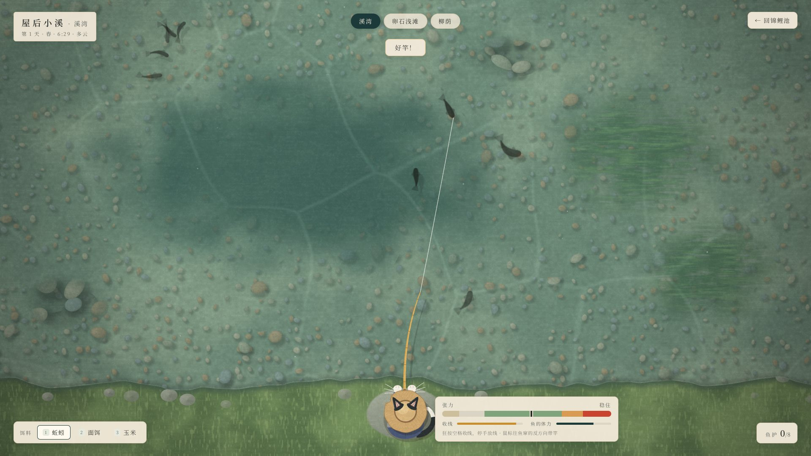
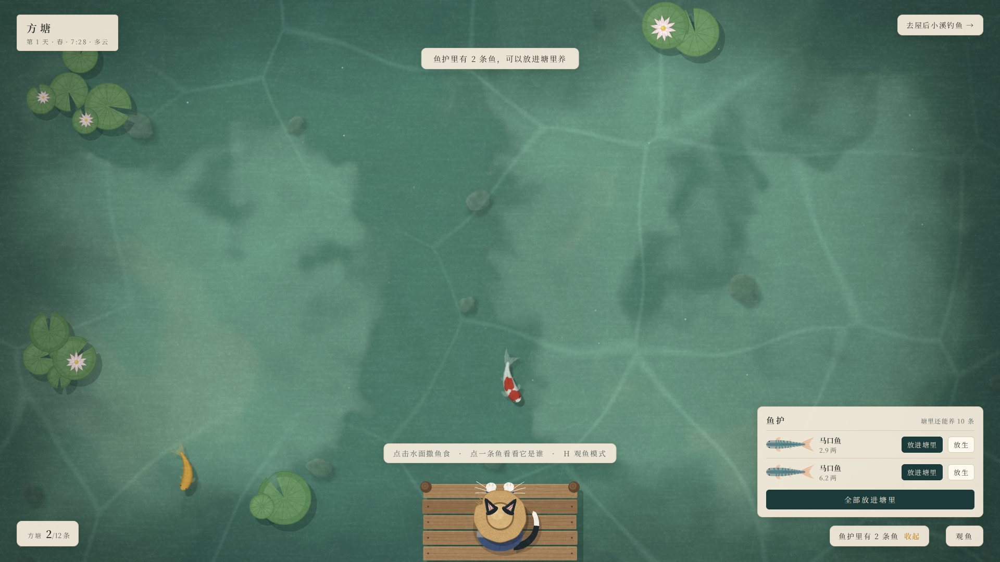

# 半亩方塘（暂定名）

国风治愈的钓鱼养鱼游戏，主角是一只奶牛猫阿喵：在溪里钓鱼，在外公的方塘里养鱼，以后还要重开外公的小饭馆、开荒菜地自己种饵料。PC / Steam 单机。

| 钓鱼：狂按空格收线 | 回到方塘，把鱼放进塘里养 |
|---|---|
|  |  |

## 文档

- [策划大纲](docs/game-design.md)：玩什么，包括世界观、主角、系统设计和内容规模
- [技术方案与分工](docs/production-plan.md)：怎么做、谁来做、里程碑
- [美术与音频指南](docs/art-audio-guide.md)：可直接交给画师 / 图像 AI / 音乐 AI 的风格说明、资源清单和提示词
- [开发规范](AGENTS.md)：给所有参与开发的人和 AI

## 运行

需要 Node.js 22 或更新版本。

```bash
npm install
npm run dev
```

然后用浏览器打开 http://127.0.0.1:5173/ （鱼塘）或 http://127.0.0.1:5173/?scene=fishing （钓鱼）。右上角的按钮可以在两个画面之间切换。

**鱼塘**

- 点击水面撒鱼食；点一条鱼看它的名字和来历
- 鱼护里有鱼时，右下角打开鱼护：放进塘里（塘里最多 12 条）或放生
- H：观鱼模式（隐藏界面和阿喵）

**钓鱼**

- 移动鼠标瞄准，按住左键蓄力，松开抛竿（力度会来回摆动，找准时机松手）
- 浮漂轻点是鱼在试探，沉下去并出现"！"时按空格（或点击）提竿；没动静时点击是收竿
- 遛鱼：**狂按空格收线**，按得越快收得越猛；停手就放线。让张力留在绿色区间，鱼猛冲时停一停
- 鱼往一边窜时，鼠标往反方向带竿；钻底的鱼（泥鳅、黄鳝）不这么带，会钻进水草把线挂断
- 触屏：连点屏幕收线，点在哪边竿就往哪边带
- 1 / 2 / 3：换饵料；顶部标签：换钓位；右键或 Esc：收竿
- 上鱼后：E 放进鱼护，R 放生

**调试**

- F3：显示帧率等调试信息
- F2（钓鱼画面）：调参面板，可以现场调遛鱼手感、跳时间、换天气、叫来一条稀有鱼

## 进度

- ✅ M0 鱼塘技术验证：程序生成的锦鲤、群游、撒食、观鱼模式
- ✅ M1 钓鱼原型：屋后小溪 3 个钓位、6 种鱼、抛竿到上鱼的全流程、调参面板
- ✅ M1.5 鱼的去处：狂按空格遛鱼；鱼塘开局只有外公的两条锦鲤，钓到的鱼放进鱼护，回鱼塘可以放进塘里养
- ⏳ M2 一天循环：老宅和集市场景、地图、卖鱼、存档、饵料变成消耗品、接入 Electron
- M3 菜地与饵料 · M4 喵记小馆 · M5 锦鲤育种（见[技术方案](docs/production-plan.md)第 5 节）

## 参考

- [`assets/reference/cat-brand.webp`](assets/reference/cat-brand.webp)：阿喵的品牌形象（Miao.Club）
