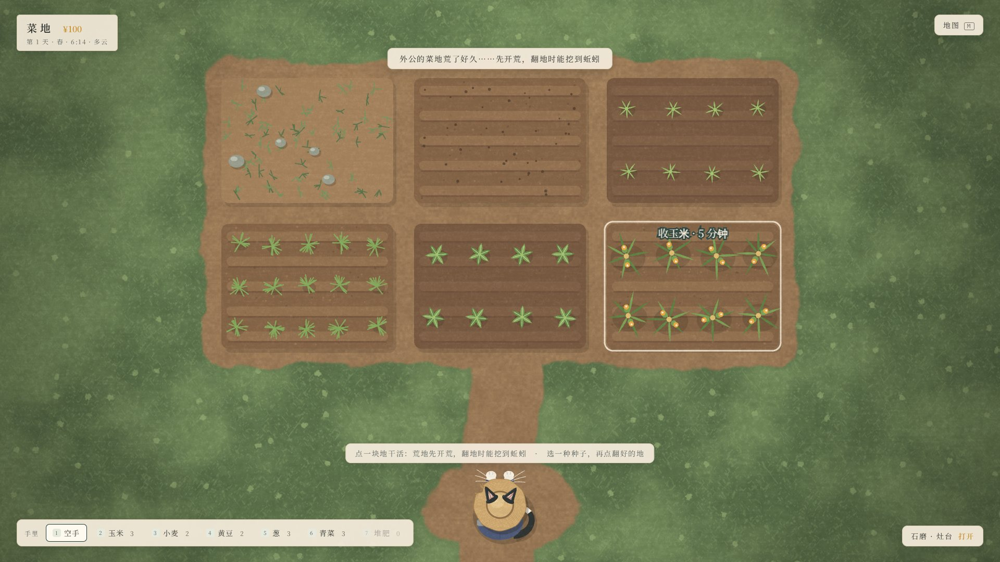
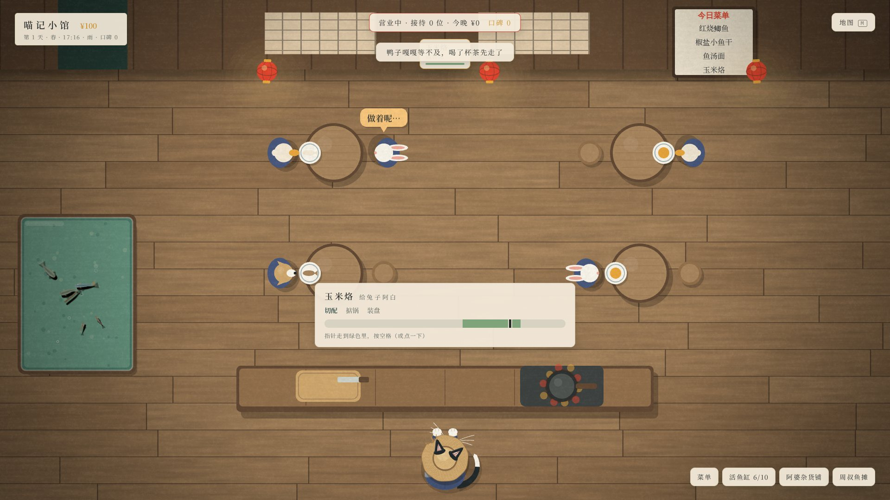

# 半亩方塘（暂定名）

国风治愈的钓鱼养鱼游戏，主角是一只奶牛猫阿喵：在屋后小溪钓鱼，把鱼放进外公的方塘里养，
送进村口重新开张的"喵记小馆"做成菜，在老宅旁边的菜地里挖蚯蚓、种玉米当鱼饵。PC / Steam 单机。

| 钓鱼：狂按空格收线 | 回到方塘，把鱼放进塘里养 |
|---|---|
|  |  |
| **菜地：翻地挖蚯蚓，种玉米小麦** | **喵记小馆：傍晚开门，亲手做菜** |
|  |  |

## 文档

- [策划大纲](docs/game-design.md)：玩什么，包括世界观、主角、系统设计和内容规模
- [技术方案与分工](docs/production-plan.md)：怎么做、谁来做、里程碑
- [美术与音频指南](docs/art-audio-guide.md)：可直接交给画师 / 图像 AI / 音乐 AI 的风格说明、资源清单和提示词
- [开发规范](AGENTS.md)：给所有参与开发的人和 AI

## 运行

需要 Node.js 22 或更新版本。

```bash
npm install
npm run dev
```

然后用浏览器打开 http://127.0.0.1:5173/ 。也可以直接进某个画面：`?scene=pond|fishing|farm|restaurant`。
游戏会自动存档（浏览器本地）；`?fresh=1`（网页版用 `#new`）从头开始，地图里也有"重新开始"。

**到处走走**

- M 或右上角"地图"：点一个地方就走过去，路上花游戏时间（家里的方塘和菜地挨着，去小溪 10 分钟，去村口小馆 20 分钟）
- 地图里可以"回家睡觉"结束今天；到半夜 2:00 也会自动回家睡，醒来看一天的小结
- 饵料是消耗品：鱼咬走、被偷吃、上钩都用掉一份。开局有外公留下的一些，之后去菜地挖、自己做，或者去杂货铺买

**鱼塘**

- 点击水面撒鱼食；点一条鱼看它的名字和来历
- 鱼护里有鱼时，右下角打开鱼护：放进塘里（塘里最多 12 条）或放生
- H：观鱼模式（隐藏界面和阿喵）

**钓鱼**

- 移动鼠标瞄准，按住左键蓄力，松开抛竿（力度会来回摆动，找准时机松手）
- 浮漂轻点是鱼在试探，沉下去并出现"！"时按空格（或点击）提竿；没动静时点击是收竿
- 遛鱼：**狂按空格收线**，按得越快收得越猛；停手就放线。让张力留在绿色区间，鱼猛冲时停一停
- 鱼往一边窜时，鼠标往反方向带竿；钻底的鱼（泥鳅、黄鳝）不这么带，会钻进水草把线挂断
- 触屏：连点屏幕收线，点在哪边竿就往哪边带
- 1 / 2 / 3：换饵料（显示还剩几份）；顶部标签：换钓位；右键或 Esc：收竿
- 上鱼后：E 放进鱼护，R 放生

**菜地**

- 点一块地做下一步活：荒地先**开荒**，再**翻地**——这两步都有机会挖到蚯蚓（雨天、施过堆肥的地挖得多）
- 底下选一种种子（数字键也行），再点翻好的地就是**播种**；每天**浇水**，睡一觉长一天，下雨天不用浇
- 熟了点一下**收获**：玉米直接当饵，小麦磨成面粉再和成面饵，黄豆点成豆腐送去小馆
- 右下角"石磨 · 灶台"：加工，还能看库存

**喵记小馆**

- 白天：定菜单（最多 4 道）；"活鱼缸"里把鱼护的鱼放进缸（做菜的鱼从缸里捞）；
  隔壁"阿婆杂货铺"买饵料和种子，"周叔鱼摊"直接卖鱼
- 17:00 以后"开门营业"（早了可以"在店里忙到傍晚"）；客人坐下点菜，**点一下客人或者按空格**开始做
- 做菜小游戏：切配 → 掂锅 → 装盘，指针走到绿色里按空格（或点一下）；做得好卖得贵、有小费、口碑涨得快
- 客人等太久会先走，不扣钱；自己不开门的日子，小满代班（收入打七折）

**调试**

- F3：显示帧率等调试信息
- F2（钓鱼画面）：调参面板，可以现场调遛鱼手感、跳时间、换天气、叫来一条稀有鱼

## 进度

- ✅ M0 鱼塘技术验证：程序生成的锦鲤、群游、撒食、观鱼模式
- ✅ M1 钓鱼原型：屋后小溪 3 个钓位、6 种鱼、抛竿到上鱼的全流程、调参面板
- ✅ M1.5 鱼的去处：狂按空格遛鱼；鱼塘开局只有外公的两条锦鲤，钓到的鱼能放进塘里养
- 🟡 M2 一天循环：✅ 饵料消耗、库存、钱、自动存档（带版本号）、手绘地图和赶路、睡觉和一天小结；
  ⏳ 老宅院子和集市的场景插画、接入 Electron
- ✅ M3 菜地与饵料（占位画面）：6 块地、5 种作物、翻地挖蚯蚓、石磨磨面、和面饵、点豆腐
- ✅ M4 喵记小馆（占位画面）：活鱼缸、9 道菜、傍晚营业、做菜小游戏、口碑、小满代班、杂货铺和鱼摊
- ⏳ M5 锦鲤育种（见[技术方案](docs/production-plan.md)第 5 节）

## 参考

- [`assets/reference/cat-brand.webp`](assets/reference/cat-brand.webp)：阿喵的品牌形象（Miao.Club）
