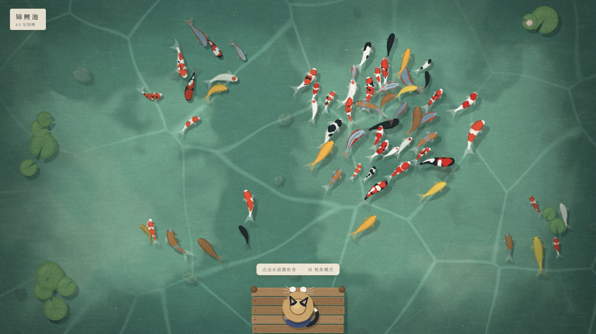

# 半亩方塘（暂定名）

国风治愈的钓鱼养鱼游戏，主角是一只奶牛猫阿喵。PC / Steam 单机，后期扩展种田。



## 文档

- [策划大纲](docs/game-design.md)：玩什么，包括世界观、主角、系统设计和内容规模
- [技术方案与分工](docs/production-plan.md)：怎么做、谁来做、里程碑
- [美术与音频指南](docs/art-audio-guide.md)：可直接交给画师 / 图像 AI / 音乐 AI 的风格说明、资源清单和提示词
- [开发规范](AGENTS.md)：给所有参与开发的人和 AI

## 运行

需要 Node.js 22 或更新版本。

```bash
npm install
npm run dev
```

然后用浏览器打开 http://127.0.0.1:5173/ 。

- 点击水面撒鱼食
- H：观鱼模式（隐藏界面和阿喵）
- F3：显示帧率等调试信息

## 参考

- [`assets/reference/cat-brand.webp`](assets/reference/cat-brand.webp)：阿喵的品牌形象（Miao.Club）
