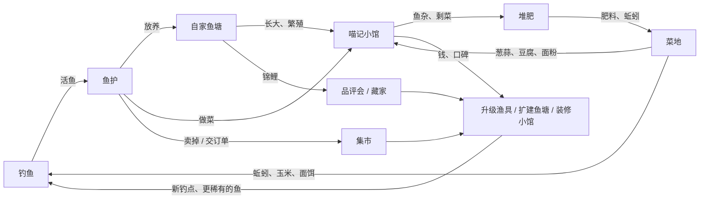
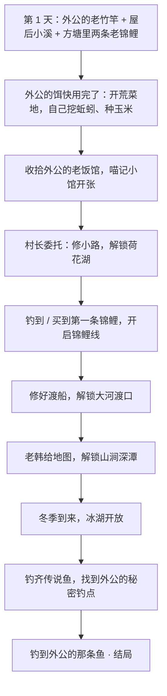

# 《半亩方塘》游戏策划大纲 v0.5

> **暂定名**：《半亩方塘》——出自朱熹"半亩方塘一鉴开，天光云影共徘徊"。
> "方塘"对应养鱼，"半亩"暗含日后种田，诗句本身的清澈、宁静也正是想要的画面气质。（上线前需在 Steam 和商标库查重。）
>
> 相关文档：
> - [技术方案与分工](production-plan.md)：怎么做、谁来做、先做什么
> - [美术与音频指南](art-audio-guide.md)：可以直接交给图像 AI / 音乐 AI / 画师的风格说明、资源清单和提示词

---

## 0. 已确定的方向

| 项目 | 决定 | 状态 |
|---|---|---|
| 平台 | PC，发行在 Steam | ✅ 已定 |
| 时间模型 | 游戏内时间（一天约 15 分钟） | ✅ 已定 |
| 联网 | 纯单机（Steam 成就、云存档照常支持） | ✅ 已定 |
| 画风 | 国风治愈 · 扁平水彩插画（见第 2 节） | ✅ 已定 |
| 主角 | **奶牛猫阿喵**，形象来自 Miao.Club 的猫（见第 4 节） | ✅ 已定 |
| 视角与结构 | **先做方案 B**：钓鱼和鱼塘是正俯视的水面画面，阿喵坐在岸边，但不能自由走动；村子、老宅是可点击的场景插画。**以后升级为方案 C**：加入可自由行走的 3/4 俯视地图（见第 5 节） | ✅ 已定 |
| 世界 | **拟人小动物的村子**，NPC 都是动物（见第 11 节） | 🟡 建议，待确认 |
| 技术栈 | TypeScript + PixiJS + Electron（理由见技术方案） | ✅ 已定 |
| 核心循环 | **钓鱼 → 养鱼 → 开饭店 → 种地**：钓到的鱼放进自家鱼塘养、送去饭店做菜卖；种地产出饵料和食材（见第 6、14、15 节） | ✅ v0.5 新增 |
| 开局鱼塘 | 外公的方塘里只剩**两条老锦鲤**，钓到的鱼可以放进去养 | ✅ 已做 |
| 遛鱼操作 | **狂按空格收线**，鼠标带竿方向（见 7.3） | ✅ 已做 |
| 饭店玩法 | 傍晚短时间主动经营，还是挂机经营（见 14.6） | 🟡 待确认 |

---

## 1. 游戏概述

**一句话**：一只城里来的酷猫回到乡下外公的老宅，在溪边湖畔钓鱼，把外公的方塘重新养满，让村口外公的老饭馆重新开张，最终钓到外公一生都没钓到的那条鱼。

**三条设计支柱**（所有系统设计都要对照这三条）：

1. **看着就舒服**：鱼塘本身就是一幅会动的画。什么都不做、只是看鱼游，也是一种享受。
2. **每一竿都有期待**：鱼影是大是小、是什么鱼、会不会破纪录，永远有一点悬念。
3. **养出独一无二的鱼**：每条锦鲤的花纹都由基因生成、不会重复，是"我亲手培育"的那条。

**治愈向底线**：没有体力条、鱼不会死（只会生病和停止生长）、熬夜不惩罚、没有失败结局。压力只来自玩家自己想要的目标。

---

## 2. 画风：不是宫崎骏，是"国风扁平水彩"

参考图（碧潭观鱼）不是宫崎骏（吉卜力）风格：

| | 吉卜力 / 宫崎骏 | 参考图的风格 |
|---|---|---|
| 造型 | 细腻手绘、细节丰富 | 扁平、简洁、几乎无描边 |
| 光影 | 强烈的暖光、云影、厚涂 | 柔和漫射光，没有强高光 |
| 色彩 | 饱满的绿、蓝、暖黄 | 低饱和、偏灰的青绿（接近莫兰迪色） |
| 质感 | 水彩背景 + 动画赛璐璐人物 | 整体带水彩 / 水粉颗粒和纸张纹理 |
| 气质 | 日式田园、奇幻 | 新中式、极简、安静 |

比较准确的叫法是 **"国风治愈 · 扁平水彩插画"**。

**鱼、水波、光斑、天气都可以用代码程序化绘制**，每条锦鲤的花纹由基因自动生成。场景物件、角色需要画师或图像 AI 来画。具体规则见[美术与音频指南](art-audio-guide.md)。

### 2.1 猫的形象需要"游戏版"改造

你设计的猫是**粗黑描边、日漫贴纸风**，和鱼塘的**无描边、低饱和水彩风**放在一起会打架。建议分两个版本：

| 版本 | 用途 | 风格 |
|---|---|---|
| **品牌版**（现在这张） | Miao.Club 标志、Steam 头像、周边、贴纸 | 保持原样 |
| **游戏版**（重新绘制） | 钓鱼和鱼塘画面里的俯视阿喵、举鱼插画、对话立绘；以后方案 C 的行走角色 | 保留全部设计要素，改成游戏画风：描边变细、改为深色而非纯黑，毛发简化成色块，颜色往游戏色板靠 |

角色保留细描边是游戏里的常用做法，能让角色从背景里"跳"出来，一眼就看到自己在哪。

> ⚠️ 参考作品只借鉴风格。它的界面布局、文案、功能设计要避免照搬，也不要把它的截图喂给图像 AI 当参考图。

---

## 3. 世界观与故事

- **舞台**：南方山间的小村 **柳溪村**（暂定），住着各种拟人的小动物。村里有溪、有荷塘、有大河渡口，四季分明。时代是现代，带一点怀旧感。
- **主角**：一只奶牛猫，默认名 **阿喵**（玩家可以改名），在城里过惯了快节奏的生活。
- **开场**：猫外公去世后，阿喵回到老宅。屋后的方塘还在，水却浅了，只剩外公养了十几年的**两条老锦鲤**（红白"大红"、黄金"阿金"）；旁边是一块荒了的菜地，村口还有外公年轻时开过的小饭馆，门板上落满了灰。阿喵在屋里找到外公留下的**草帽、打着补丁的旧外套、一根老竹竿**，还有一本**钓鱼笔记**。
  - **造型由来**：墨镜是阿喵自己从城里带来的，草帽、外套、竹竿都是外公的。"城里的酷"加上"外公的旧物"，就是主角的标志造型。
- **主线**：外公笔记既是图鉴，也是故事线。笔记里记着每一种鱼的线索，最后几页写着几条"传说中的鱼"，其中一条外公钓了一辈子都没钓到。
- **结局**：钓到"外公的那条鱼"后，玩家可以选择放生它。游戏在结局后继续，没有终点。
- **三条支线从第一天就摆在眼前**：方塘要养满（第 8 节）、饭馆要重开（第 14 节）、菜地要开荒（第 15 节）。它们都围着"鱼"转：鱼从溪里来，在塘里长大，到饭馆变成菜；菜地给钓鱼供饵，给饭馆供菜，饭馆的边角料又回到菜地做肥。

---

## 4. 主角：阿喵

### 4.1 设计要素（游戏版必须保留）

参考：[`assets/reference/cat-brand.webp`](../assets/reference/cat-brand.webp)

| 要素 | 细节 |
|---|---|
| 毛色 | 奶牛猫：头顶和耳朵黑色，脸下半部和胸口白色，**白手套爪子**，粉鼻子，耳朵内侧粉色 |
| 墨镜 | 黑色方框墨镜，**标志性元素，一直戴着** |
| 草帽 | 编织草帽，帽檐有磨损破口 |
| 外套 | 靛蓝色外套，袖子上有一块灰色补丁 |
| 内衫 | 米白色中式立领衫，深蓝色盘扣 |
| 鱼竿 | 竹制鱼竿，缠着绳结，红白浮漂 |
| 秧苗 | 手里的一捆秧苗，**正好对应后期"稻鱼共生"的种田玩法** |
| 神态 | 淡定、高冷、面无表情 |

一个小彩蛋：奶牛猫的黑白配色和"白写"锦鲤一模一样，可以做一个隐藏锦鲤品种"喵纹"。

### 4.2 性格

表面淡定高冷，其实看到鱼就挪不动步。做成待机小动作：盯着锦鲤看、偷偷舔嘴。

> 小满："你是猫，为什么不吃自己养的锦鲤？"
> 阿喵："外公说过，好鱼是用来看的。"

### 4.3 猫咪专属能力

| 能力 | 效果 |
|---|---|
| **胡须感应** | 附近有稀有鱼时胡须会抖动，钓鱼等级越高感应越准 |
| **打盹** | 在钓位上或鱼塘边打个盹，快进一段时间（比如等到黄昏出鱼） |

### 4.4 阿喵在画面里的样子

**方案 B（现在）**：钓鱼和鱼塘画面都是从正上方往下看，阿喵坐在画面底部的岸边，玩家看到的是**它的头顶和背影**：一顶圆草帽、帽檐下露出的两只黑耳朵、靛蓝外套的肩背、甩动的尾巴，以及伸向水面的竹竿。这个轮廓一眼就能认出来，而且只需要画一个朝向。

| 类别 | 动作（俯视） |
|---|---|
| 待机 | 呼吸起伏、甩尾、耳朵转动；随机小动作：歪头、伸懒腰 |
| 钓鱼 | 抛竿、等鱼（尾巴轻甩）、提竿、遛鱼后仰、上鱼 |
| 鱼塘 | 撒饲料 |
| 其他 | 打盹（草帽歪到一边）、开心（耳朵竖起、尾巴翘高）、失落（耳朵耷拉） |

**高光时刻用插画**：上鱼时切到一张"阿喵举鱼"的特写插画，鱼由代码画进阿喵的爪子里，所以每一种鱼、每一条锦鲤都能被"举"起来。对话时显示阿喵的半身立绘。

**方案 C（以后）**：加上正面、背面、侧面三个朝向的行走角色，动作增加行走、小跑、舔爪、打哈欠，以及种田的锄地、浇水、插秧、收割。

墨镜挡住了眼睛，**情绪全靠耳朵、尾巴和嘴巴表达**，因此不需要做眼睛动画，能省不少工作量。动画用"拆件 + 代码骨骼动画"实现（见技术方案），不用逐帧画。

---

## 5. 游戏结构

### 5.1 方案 B：场景式（1.0 先做这个）

游戏由几种画面组成，用鼠标点击在它们之间切换：

| 画面 | 样子 | 能做什么 |
|---|---|---|
| **钓鱼画面** | 正俯视的一片水面，底部是岸边，阿喵坐在岸上 | 钓鱼（见第 7 节）；切换钓位 |
| **鱼塘画面** | 正俯视的锦鲤池，就是参考图那样的画面，阿喵坐在池边 | 喂鱼、看鱼、捞鱼、摆装饰；一键进入**观鱼模式**（隐藏界面和阿喵） |
| **老宅院子** | 一张 3/4 俯视的院子插画：老宅、方塘、荒地、竹林、小路 | 点击方塘进入鱼塘画面，点击屋子进入室内，点击小路打开地图 |
| **老宅室内** | 一张平视插画 | 点击床（睡觉存档）、收音机（天气预报）、外公笔记、奖杯架 |
| **柳溪村集市** | 一张露天集市插画，NPC 站在各自的摊位后面 | 点击 NPC 对话、买卖、接订单 |
| **喵记小馆** | 一张平视的小饭馆插画：灶台、活鱼缸、四五张桌子 | 定菜单、傍晚开门营业、看口碑（见第 14 节） |
| **菜地** | 正俯视的一块地，和鱼塘画面同一套画法 | 锄地（挖蚯蚓）、播种、浇水、收获（见第 15 节） |
| **地图** | 一张夹在笔记本里的手绘地图 | 点击地点前往，路上消耗游戏时间 |

**钓位**：每个钓点有 3~5 个钓位（柳树下、大石头上、栈桥尽头、芦苇边……），每个钓位看到的水域和鱼都不一样。点击切换钓位，消耗 10 分钟游戏时间。

**为什么先做 B**：钓鱼、养鱼、育种这些核心乐趣都在水面画面里，B 能用最少的美术量最快做出可玩的版本，验证"好不好玩"。

### 5.2 方案 C：可行走版（以后升级）

在 B 的基础上加入 **3/4 俯视的行走地图**（类似星露谷、动森）：阿喵用键盘 WASD 或手柄在老宅、村子、各钓点之间自由走动。

- **钓鱼画面和鱼塘画面原样保留**：阿喵走到钓位或塘边按一下交互键，就切换进去。
- 场景插画被行走地图取代；室内仍然可以保持插画形式，控制美术量。
- 需要新增：行走地图、三个朝向的角色拆件和行走动画、NPC 的场景小人。

B 的钓鱼、鱼塘、育种、经济、时间系统在 C 里**全部不用重做**，升级只是在"地点之间怎么移动"这一层加东西。技术上从第一天起就按这个边界来组织代码。

### 5.3 时间

| 项目 | 设定 |
|---|---|
| 一天 | 6:00 → 次日 2:00 |
| 流速 | 1 游戏小时 ≈ 45 现实秒，**一天约 15 分钟**（设置里可调 0.5× ~ 2×） |
| 暂停 | 打开菜单、对话、上鱼展示时，时间暂停 |
| 熬夜 | 到 2:00 阿喵自动回家睡觉，**没有惩罚** |
| 睡觉 | 触发每日结算：鱼塘生长和繁殖、水质变化、钓点鱼情恢复、订单刷新、写鱼塘日志 |
| 季节 | 每季 14 天，一年 56 天（可调） |
| 天气 | 晴 / 多云 / 雨 / 雷雨 / 雾 / 雪（冬），老宅里的**旧收音机**能听到明天的天气预报 |

时间本身就是资源：清晨、黄昏、夜里出的鱼不同，下雨天有的鱼特别活跃。

### 5.4 一天的样子（示例）

> 6:00 阿喵醒来，打开收音机：明天有雷雨，大河的"墨鲤"可能会出现 →
> 6:30 到屋后喂锦鲤、捞落叶 → 7:00 打开地图去溪边，在大石头钓位上钓清晨的马口鱼 →
> 9:00 回菜地锄两垄地，挖出 6 条蚯蚓，顺手收了一筐玉米 →
> 11:00 到村里集市，把多的鱼卖给水獭周叔，在公告栏交一个订单 →
> 午后在荷花湖钓鱼，胡须突然一抖，钓到一条别人放生的红白锦鲤！→
> 17:00 回家，把锦鲤放进方塘，起名"小红"；鲫鱼和泥鳅送去小馆的活鱼缸 →
> 18:00 喵记小馆开门：红烧鲫鱼、泥鳅钻豆腐，村长点名要一道玉米烙 →
> 21:00 打烊，带着夜光漂去溪边夜钓黄鳝 → 1:00 回家睡觉，看鱼塘日志和小馆账本

---

## 6. 核心循环

四件事，全都围着"鱼"：**钓鱼**是主菜，**养鱼**是积累，**饭店**是出口，**种地**是补给。

| 东西 | 从哪来 | 到哪去 |
|---|---|---|
| 鱼 | 钓（主要）、鱼塘繁殖 | 鱼塘养着、小馆做菜、集市卖、交订单、放生 |
| 饵料 | 外公留下的一点（开局）→ **菜地**（蚯蚓、玉米、面饵）→ 阿婆的杂货铺（保底） | 钓鱼消耗 |
| 食材 | 菜地（葱蒜、青菜、黄豆、小麦） | 小馆做菜 |
| 肥料 | 小馆的鱼杂和剩菜进堆肥箱 | 菜地增产，堆肥里还会生蚯蚓 |
| 钱 | 小馆营业（主要）、集市卖鱼、订单 | 渔具、扩建鱼塘、装修小馆、种子 |

- **短循环（1~3 分钟）**：观察鱼影 → 抛竿 → 诱鱼 → 咬钩 → 遛鱼 → 上鱼
- **中循环（一天）**：早上菜地 → 白天钓鱼 → 傍晚开店 → 夜钓 → 睡觉结算（鱼塘生长、作物生长、小馆账本）
- **长循环（数周）**：补全外公笔记、把方塘养满并选育锦鲤、把小馆做出名气、钓传说鱼

**不卡人的底线**：任何一条线都不能卡住钓鱼。饵料用完了，菜地随手能挖蚯蚓，杂货铺也能买；小馆不开门也不扣钱；鱼塘满了，鱼护里的鱼可以放生。

---

## 7. 钓鱼系统

### 7.1 钓鱼画面

从上到下：一片俯视的水面（鱼影在里面游）→ 岸边（草地、石头或栈桥）→ 坐在岸上的阿喵（草帽、耳朵、尾巴），竹竿从它手里伸向水面，鱼线连着浮漂。

### 7.2 流程

| 步骤 | 玩法 | 技巧空间 |
|---|---|---|
| **1. 选钓位** | 每个钓点有 3~5 个钓位。水里只看得到鱼的**影子**，按大小分为小 / 中 / 大 / 巨四档；水花、气泡提示鱼群；浅滩、深水、水草、石缝出的鱼不同 | 认影子、找好位置 |
| **2. 瞄准抛竿** | 鼠标指向水面，出现落点圈；按住蓄力，落点圈往远处推；松开后阿喵甩竿，鱼线划出弧线，浮漂落水泛起涟漪。落点有随机偏差（竿越好越准） | 抛在鱼的前方而不是头顶，**砸到鱼头会把它吓跑** |
| **3. 诱鱼** | 阿喵尾巴轻轻甩着等鱼。鱼察觉饵料后游过来，绕饵、试探（浮漂轻颤），最后咬钩（浮漂猛沉 + 提示音） | 饵料对不对胃口，决定鱼来不来 |
| **4. 提竿** | 咬钩后的短暂窗口内按空格（或点击）；太早提竿会惊走鱼 | 狡猾的鱼窗口更短 |
| **5. 遛鱼** | 张力小游戏（见 7.3）。鱼影拖着鱼线乱窜，阿喵后仰拉竿，**竹竿弯得越厉害张力越大** | 核心手感 |
| **6. 上鱼** | 鱼被拉出水面，切到**阿喵举鱼的特写插画**，弹出鱼的卡片：名称、重量、稀有度，提示"新纪录""笔记新页"；选择**放进鱼护**或**放生** | |

"举鱼"是整个游戏最常出现的高光画面，也是玩家最常截图分享的瞬间，插画要画得有趣。

### 7.3 遛鱼：张力小游戏

- **狂按空格**收线（像摇线轮）：按得越快，张力越高、收得越猛。**停手**就放线：张力下降。触屏上是连点屏幕。
  提竿也是空格，所以"咬钩→提竿→狂按"一气呵成。鼠标在遛鱼时只管带竿方向。
- 张力太高会断线，太低会脱钩，保持在安全区间里鱼会逐渐没力。鱼猛冲时要停手，等它冲完再按。
- 手慢也能钓：每秒按三四下，张力偏低，鱼乏得慢一些，也能拉上来，只是要多花点时间。
- **控竿方向**：鱼往左冲时把鼠标往右带，能卸掉一部分拉力，还让鱼乏得更快。
  **钻底的鱼**会往水草里钻（界面提示"往反方向带竿"），不带竿的话"钻草"会涨满，线挂断。
- 鱼体力归零 → 拉到岸边 → 上鱼。
- 无障碍选项（以后做）："按住收线"模式，给连按吃力的玩家。

不同的鱼有不同的挣扎方式：

| 挣扎方式 | 手感 | 代表鱼 |
|---|---|---|
| 温顺 | 张力平稳，新手友好 | 鲫鱼、麦穗鱼 |
| 爆冲 | 突然猛拉，要及时松手 | 鳜鱼、黑鱼、翘嘴 |
| 耐力 | 力气不大但体力很多，拉锯战 | 草鱼、青鱼、鲶鱼 |
| 钻底 | 往水草、石缝里钻，要侧向控竿 | 黄鳝、黄颡鱼 |
| 狡猾 | 假装没力气再突然爆发 | 传说鱼 |

### 7.4 鱼的出现条件（全部写在配置表里）

- **钓点**、**钓位**和**区域**（浅滩 / 深水 / 水草 / 石缝）
- **时段**：清晨 / 白天 / 黄昏 / 夜晚
- **天气**、**季节**
- **饵料偏好**：蚯蚓、面饵、玉米、红虫、河虾、路亚假饵……
- **重量区间**：同种鱼也有大有小，破纪录就是乐趣

外公笔记里每种鱼都有一句线索，比如"端午前后的傍晚，荷塘东边柳树下，用玉米"。玩家不用查攻略，**看笔记就能推理**。

### 7.5 鱼护与鱼情

- **鱼护**：活鱼暂存在鱼护里，容量有限（初始 8 条，可升级）。回家后决定每条鱼的去处：**放进鱼塘**、**送去小馆的活鱼缸**、卖给周叔，或者放生。
  （已做：鱼塘画面里打开鱼护，一条条放进塘里或放生。）
- **鱼情**：每个钓点有"鱼情值"。一天钓得太多，鱼情下降、鱼变少，几天后恢复；放生能减缓下降。这样鼓励玩家轮换钓点，也和"放生"的温柔气质呼应。
- **杂物**：偶尔钓上外公遗落的旧物（旧烟斗、生锈的鱼钩盒），这些是剧情道具。

### 7.6 渔具

| 渔具 | 影响 | 成长线（示例） |
|---|---|---|
| 鱼竿 | 抛投距离、精度、张力上限 | 外公的老竹竿 → 碳素竿 → 老韩手作竿 → 外公的珍藏竿（剧情） |
| 鱼线 | 断线阈值 | 普通线 → 耐磨线 → 大物线 |
| 浮漂 | 咬钩提示清晰度 | 红白漂（初始）→ **夜光漂（夜钓必备）** → 灵敏漂（小鱼咬钩更明显） |
| 鱼钩 | 脱钩概率 | |
| 饵料 | 决定吸引哪类鱼 | 开局外公留下的一点 → 菜地自产（见 7.8）→ 杂货铺买 |
| 窝料 | 打窝后一段时间内某类鱼出现率提高 | 后期可用自种的玉米、豆子做 |

### 7.7 钓点与鱼种（1.0 目标约 40 种）

**原则**：不出现国家重点保护水生野生动物，不出现长江十年禁渔相关鱼种，传说鱼全部虚构。

| 钓点 | 解锁 | 代表鱼（示例） | 传说鱼 |
|---|---|---|---|
| 屋后小溪 | 初始 | 鲫鱼、麦穗鱼、泥鳅、白条、马口鱼、黄鳝（夜）、溪蟹 | 青鳞（春夜、细雨） |
| 荷花湖 | 修好小路 | 鲤鱼、草鱼、鲢鱼、鳙鱼、鳊鱼、黑鱼、翘嘴、**被放生的锦鲤（稀有）** | 金鳞（满月夜） |
| 大河渡口 | 渡船 | 鲶鱼、鳜鱼、鲈鱼、青鱼、黄颡鱼、鳡鱼 | 墨鲤（雷雨夜） |
| 山涧深潭 | 老韩给的地图 | 虹鳟、光唇鱼、溪石斑 | 玉鳟（雾晨） |
| 冰湖 | 仅冬季 | 冰钓鲫鱼、鳙鱼、河鲈、狗鱼 | 雪鲈（大雪天） |
| 外公的秘密钓点 | 主线后期 | —— | **外公的那条鱼**（最终） |

冰湖可以做成"凿冰洞"的变体玩法。海边钓点留作后期扩展。

### 7.8 饵料从哪来

饵料是**消耗品**：鱼咬走、被偷吃、上鱼都算用掉一份；空竿收回来不消耗。

| 饵料 | 开局 | 自己做 | 保底 |
|---|---|---|---|
| 蚯蚓 | 外公的铁皮罐里有 20 条 | **锄地时挖出来**（雨后、施过堆肥的地挖到的多）；后期建蚯蚓床，每天产一些 | 阿婆的杂货铺 |
| 面饵 | 半袋面粉，够做 20 份 | 菜地种**小麦** → 磨坊磨成面粉 → 和成面饵（也能加玉米面、豆粉做成不同的"配方饵"） | 杂货铺 |
| 玉米 | 一小把，10 粒 | 菜地种**玉米**：鲜玉米粒做饵，晒干磨碎做**窝料** | 杂货铺 |
| 窝料（打窝） | 没有 | 玉米、黄豆、酒糟；打窝后一段时间内某类鱼出现得多 | 杂货铺 |

外公的存货大约够玩家钓两三天，正好在这时候引导玩家去开荒菜地（小满会来提醒："外公以前都是在菜地里挖蚯蚓的！"）。

---

## 8. 鱼塘系统

### 8.1 鱼塘的成长

- 开局：外公的方塘里只剩**两条老锦鲤**（大红、阿金），能养 12 条鱼。钓到的鱼放进来养，塘就慢慢热闹起来。（已做）
- 攒钱清淤、扩建，塘能养得更多。
- 扩建后分为三类：
  - **锦鲤池**：观赏、育种、参加品评会，是游戏的"门面"。
  - **经济塘**：养草鱼、鲫鱼等，稳定卖钱。
  - **苗池**：繁殖孵化、挑选鱼苗。

### 8.2 鱼塘属性

| 属性 | 作用 |
|---|---|
| 容量 | 按水体大小计算，大鱼占的容量更多 |
| 水质（0~100） | 鱼多、剩饵多、久不清理就会下降；水草、过滤器、换水能提升 |
| 溶氧 | 夏天和夜里偏低，增氧泵解决 |
| 水温 | 跟随季节；冬天鱼几乎不吃不长，符合真实 |

### 8.3 每一条鱼都是个体

每条鱼有：品种、名字、年龄、成长阶段（鱼卵 → 鱼苗 → 幼鱼 → 成鱼）、体长和重量、健康、饱食度、**基因**、父母。

每日生长 = 基础速度 × 饱食系数 × 水质系数 × 水温系数

### 8.4 鱼塘里能做的事

都在鱼塘画面里完成：

- **撒饲料**：点击水面撒一把，鱼群围过来抢食。
- **点鱼**：显示这条鱼的名字和来历（已做：浮在鱼头上的名牌）；以后弹出完整卡片，显示品种、体长、品相分、父母。
- **放鱼**：打开鱼护，把钓回来的鱼放进塘里，阿喵在栈台上把鱼送下水（已做）。
- **捞网**：把选中的鱼移到别的池、送去小馆、卖掉或送人。**锦鲤只看不吃**：锦鲤不能送去小馆。
- **清理**：捞起秋天的落叶、夏天的水藻。
- **摆装饰**：见第 10 节。
- **治病**：水质长期太差，鱼身上会出现白点、游得变慢，买药治好。鱼不会死。

### 8.5 设施（逐步自动化）

增氧泵 → 过滤器 → 自动投喂器 → 遮阳网（夏）→ 保温棚（冬）

前期手动喂食、清理，有生活感；后期逐步自动化，让玩家把精力放在钓鱼和育种上。

---

## 9. 锦鲤育种（长线核心）

### 9.1 基因模型（设计层，具体算法在代码实现）

| 基因 | 表现 | 关联品种 |
|---|---|---|
| 底色 | 白 / 黄 / 黑 / 红 / 茶 / 银灰 | 所有品种的基础 |
| 红斑（绯） | 覆盖率、斑块大小、边缘清晰度 | 红白、三色 |
| 墨斑 | 覆盖率、分布位置（身上 / 贯穿头部） | 大正三色、昭和三色、白写 |
| 光泽 | 无 / 金属光 | 黄金、白金 |
| 鳞型 | 全鳞 / 德国鳞（背部一排大鳞）/ 网纹鳞 | 秋翠、浅黄、落叶 |
| 体型 | 纺锤 / 丰满 / 细长 | 品评分 |
| 鳍 | 普通 / 长鳍 | 稀有外观 |
| 丹顶 | 只有头顶一个红圆（隐性、稀有） | 丹顶，品评会最高分潜力 |

**品种由外观规则自动判定**：白底 + 红斑 = 红白；再加少量墨斑 = 大正三色；黑底 + 红 + 白 = 昭和三色；全身金属黄 = 黄金……约 15 个品种，外加隐藏品种"喵纹"，而每一条鱼的具体花纹都不一样。

### 9.2 繁殖流程

1. **配对**：春季和初夏是繁殖季，在苗池里选两条成年锦鲤，放入鱼巢。
2. **产卵孵化**：几天后孵出一窝约 20 条鱼苗。
3. **花纹显现**：鱼苗几乎是纯色的，随着长大，花纹逐渐"浮现"。
4. **选别**（真实锦鲤养殖里的重要环节）：花纹初显时挑出最有潜力的几条留下，其余卖给鱼苗贩子或放进经济塘。
5. **遗传**：连续性状取父母之间的值再加随机浮动，部分性状有显隐性，约 1%~3% 的概率发生变异。养殖等级越高，越能预测子代的花纹概率。

### 9.3 品相与品评会

- **品相分（0~100）**：体型、色质（红的浓淡、白的纯净）、花纹（平衡感、边缘、头部花纹）、大小。
- **品评会**：每季最后一天在镇上举行，按体长分组；获奖得奖金、声望、奖杯（可摆在家里）。冬季大赛是年度总决赛。
- **锦鲤来源**：从锦鲤藏家林先生那里买第一条，或在荷花湖小概率钓到别人放生的锦鲤。钓到第一条锦鲤时开启锦鲤线。

---

## 10. 观鱼与装饰

- **观鱼模式**：在鱼塘画面一键隐藏所有界面和阿喵，只剩鱼塘、环境声和音乐，可以当作放松或工作时的背景。（后期评估是否加"桌面小窗置顶"模式，Steam 上这类桌面挂机游戏很受欢迎。）
- **装饰**：睡莲、荷花、菖蒲、石灯笼、小石桥、汀步、假山、竹筒流水（惊鹿）、水车、乌龟……大部分纯观赏，少量有功能（水草改善水质、荷叶在夏天遮阳降温）。
- **鱼塘日志**：每天结算时自动生成几条趣事，比如"小红今天抢到了最多的鱼食""新孵出 18 条小鱼""一只白鹭在塘边站了一下午""阿喵在塘边盯着鱼看了整整一小时"。开发成本低，但很有陪伴感。
- **季节和天气表现**：雨滴涟漪、春天落花、秋天落叶、冬天结薄冰、夏夜萤火虫。这些全部用粒子和着色器实现，不需要额外美术。
- **自绘锦鲤**（可选，后期）：在鱼身上画自己的花纹放进池里。只能观赏，不参与繁殖和买卖，避免破坏育种系统。

---

## 11. 柳溪村、NPC 与订单

整个村子住的都是拟人的小动物，每个 NPC 的物种都和身份相关。NPC 控制在 6 个左右，站在集市插画里各自的摊位后面（只做待机动作，不做行走），点击对话时显示立绘。

| NPC | 物种（建议） | 身份 | 功能 |
|---|---|---|---|
| 周叔 | 水獭 | 鱼贩 | 收鱼，每天报价不同 |
| 阿婆 | 仓鼠（爱囤货） | 杂货铺 | 种子、饵料（保底）、饲料、药品 |
| 老韩 | 苍鹭（捕鱼高手） | 渔具匠，外公的老钓友 | 渔具升级；讲外公的往事；给山涧地图 |
| 小满 | 小柴犬 | 邻居家的孩子 | 新手引导；出图鉴挑战（"你能钓到比我还大的鲫鱼吗？"）；小馆代班 |
| 林先生 | 丹顶鹤（和"丹顶"锦鲤呼应） | 城里来的锦鲤藏家 | 卖第一条锦鲤；高价收购精品锦鲤；品评会引路人 |
| 村长 | 老水牛 | 村长 | 公告栏订单；出钱修路、修渡船，解锁钓点 |

- **订单**：公告栏每天 1~3 个委托，比如"要 3 条 2 斤以上的鲫鱼""要一条品相 70 分以上的红白"。奖励有钱、好感、特殊饵料、装饰、配方。
- **好感**：轻量设计。送鱼能提升好感，好感高了能解锁折扣、剧情和特殊商品。

---

## 12. 经济与成长

- **货币**：元（现代背景，简单直白）。
- **定价**：`基础价 × 稀有度系数 × 重量系数 × 品相系数`
- **市场波动**：周叔每天的收购价有浮动，同一种鱼当天卖多了会降价，鼓励多样化。
- **技能等级**：
  - 钓鱼等级：提升抛投精度和胡须感应范围；高等级能从影子看出鱼的类别。
  - 养殖等级：解锁设施；高等级能预测繁殖结果。
  - 种植等级、料理等级（菜地和小馆上线时加入）。
- **解锁主线（示例）**：

---

## 13. 外公笔记（图鉴）与成就

- **笔记就是图鉴**：每种鱼一页，一开始只有外公手写的线索批注；钓到后补全插画、最大纪录、首次钓到的日期。
- **传说鱼页面**：只有外公的只言片语和几张潦草的速写，驱动玩家去探索。
- **锦鲤页**：记录玩家培育出的每一个品种，以及自己最得意的几条鱼。
- **Steam 成就（约 30 个）**：第一条鱼、笔记完成 25% / 50% / 100%、第一次繁殖、培育出丹顶、培育出喵纹、品评会冠军、钓齐 5 条传说鱼、结局……

---

## 14. 喵记小馆（饭店）

村口是外公年轻时开过的小饭馆，关门多年。阿喵把它收拾出来，挂上新招牌 **"喵记小馆"**（呼应 Miao.Club）。饭店是鱼最主要的出口，也是中后期主要的收入。

### 14.1 定位

- 小馆**只卖自己钓的、自己养的鱼**，菜地种的菜：顾客吃的是阿喵这一天的收获。
- 这让每种鱼都有用处：麦穗鱼、白条这类小鱼单卖不值钱，**炸成小鱼干**却是招牌下酒菜；泥鳅、黄鳝有专门的菜。
- 治愈向：不会亏钱、没有差评，客人不满意只是少给点小费、口碑涨得慢一点。

### 14.2 活鱼缸与食材

- 小馆后厨有一口**活鱼缸**（初始 10 条，可升级）：鱼护里的鱼、鱼塘里的经济鱼可以送进来。缸里的鱼几天内不做就会"瘦"，价值慢慢下降，提醒玩家别囤太多。
- 配料来自菜地：葱、蒜、姜、青菜、黄豆（做豆腐）、小麦（面粉、面条）、玉米。没有配料也能做"清蒸""红烧"这类只要鱼的菜。

### 14.3 菜谱（示例，全部写进配置表）

| 菜 | 用料 | 说明 |
|---|---|---|
| 红烧鲫鱼 | 鲫鱼 + 葱 | 开店第一道菜 |
| 鲫鱼豆腐汤 | 鲫鱼 + 豆腐 | 越大的鲫鱼汤越白 |
| 椒盐小鱼干 | 麦穗鱼 / 白条 ×3 | 小鱼的去处，下酒菜 |
| 泥鳅钻豆腐 | 泥鳅 + 豆腐 | 地方老菜 |
| 黄鳝煲 | 黄鳝 + 蒜 | 夜钓的奖励，贵 |
| 玉米烙 | 玉米 | 不用鱼的甜点，给不吃鱼的客人（比如兔子） |
| 鱼汤面 | 任意鱼 + 面条 | 万能菜，把零碎的鱼用掉 |
| 外公的招牌菜 | 剧情解锁 | 从外公笔记的菜谱页里复原 |

菜谱来源：外公笔记里夹着的旧菜谱（剧情）、NPC 好感奖励、自己试菜（两样食材放一起做，可能做出新菜）。

### 14.4 营业

- **营业时间**：傍晚 17:00~20:00（游戏时间），现实时间两分多钟，正好是钓了一天之后换换口味。
- **开店前**：从活鱼缸和菜地库存里定今天的菜单（最多 4~6 道）。
- **营业中**：村民陆续进店点菜。阿喵掌勺，一道菜是一个 5~10 秒的小操作（例如切配、掂锅、装盘三下点击），做得好菜品分高、小费多。
- **不想开店**：可以不开，或者让小满代班（按菜单自动出菜，收入打七折）。
- **口碑**：菜做得好、菜单丰富、用到稀有鱼，口碑上涨 → 客人更多、解锁新客人（城里来的美食博主、林先生……）。

### 14.5 特殊客人

- 有的客人点名要某种鱼做的菜（"想吃一口黄鳝煲"），相当于小馆版的订单，驱动玩家去特定钓点、特定时段钓鱼。
- 节日（端午、中秋、年夜饭）有专门的宴席订单。

### 14.6 待确认：经营的方式

| 方式 | 手感 | 优点 | 缺点 |
|---|---|---|---|
| **A 傍晚主动经营**（推荐） | 类似《潜水员戴夫》的寿司店：白天钓鱼、傍晚开店亲手做菜，两分多钟 | 钓鱼和做菜交替，节奏好；自己钓的鱼被客人吃掉，成就感强 | 要做做菜小操作和客人动画，工作量大一些 |
| B 挂机经营 | 定好菜单就不用管，睡觉时结算收入 | 做起来快，完全不打扰钓鱼 | 小馆只是个"卖鱼的另一个按钮"，存在感弱 |

推荐 **A，并保留 B 作为"让小满代班"的选项**：想做菜的日子自己掌勺，想专心钓鱼的日子交给小满。

### 14.7 和其他系统的联动

- 鱼杂、剩菜 → **堆肥箱** → 菜地肥料，堆肥里还会生蚯蚓（见第 15 节）。
- 客人吃到大鱼、稀有鱼会夸："这条鲫鱼足有二斤吧！"——钓鱼的成果被看见。
- 小馆墙上可以挂**鱼拓**（钓到的纪录鱼拓印），相当于一面会被客人看到的奖杯墙。

---

## 15. 种田：饵料和食材从地里来

菜地从一开始就是钓鱼的**补给线**：钓鱼用的饵，小馆用的菜，都从这里来。所以种田不再放到最后，而是**先做一个小而完整的菜地**（方案 B 里是点击式），以后再扩展成更大的农田玩法。

### 15.1 菜地（先做）

- 老宅旁边的荒地，开局被杂草和石头盖着，先清出 **6 块地**（以后开荒扩大）。
- 画面：正俯视，和鱼塘、钓鱼画面同一套画法，阿喵蹲在地头。
- 操作都是点击：**锄地 → 播种 → 浇水 → 收获**。下雨天不用浇水。

| 操作 | 说明 |
|---|---|
| 锄地 | 每块地锄一次，**有机会挖出蚯蚓**（1~3 条）。雨后、施过堆肥的地挖到的更多。这是前期蚯蚓的主要来源 |
| 播种 | 种子从阿婆那里买，或者从收获里留种 |
| 浇水 | 每天一次；雨天自动浇 |
| 施肥 | 用堆肥，长得更快、收得更多 |
| 收获 | 作物进库存，有的直接当饵，有的送小馆，有的拿去磨坊加工 |

### 15.2 作物（先做 5 种）

| 作物 | 季节 | 天数 | 用处 |
|---|---|---|---|
| 玉米 | 夏、秋 | 7 | 鲜粒做饵；晒干磨碎做窝料；小馆的玉米烙 |
| 小麦 | 秋种春收 | 10 | 磨面粉 → **面饵**、面条 |
| 黄豆 | 夏 | 6 | 做豆腐（小馆）；豆饼做窝料 |
| 葱蒜 | 四季 | 4 | 小馆配料 |
| 青菜 | 春、秋 | 3 | 小馆配料；喂草鱼 |

### 15.3 蚯蚓

- 锄地随机挖到（主要来源）。
- 小馆的鱼杂、剩菜和落叶进**堆肥箱**，堆肥箱里会慢慢生出蚯蚓。
- 后期建**蚯蚓床**：每天稳定产出，满足大量钓鱼的需要。

### 15.4 以后的扩展（原"后期种田"内容）

阿喵手里那捆秧苗，正好点明了更大的方向：**用中国传统的生态农法作为核心玩法**，和星露谷式的种田拉开差异。

| 联动 | 玩法 |
|---|---|
| **稻鱼共生**（招牌玩法） | 插秧后在稻田里放养鱼苗：鱼吃虫除草、鱼粪肥田，水稻增产，秋收时还能收获一批"稻花鱼" |
| **桑基鱼塘** | 塘边种桑 → 桑叶养蚕 → 蚕沙喂鱼 → 塘泥肥桑，形成循环 |
| 鱼菜共生 | 用鱼塘水灌溉，作物长得更快 |
| 料理加成 | 小馆的菜阿喵自己吃了能获得加成（比如钓鱼幸运 +10%） |

稻鱼共生和桑基鱼塘都是被列入"全球重要农业文化遗产"的传统农法，既有文化底蕴，也是很好的宣传点。

方案 C 之后，阿喵可以走到田块上锄地、插秧、浇水、收割，体验更自然；菜地的逻辑（作物生长、库存）在方案 B 里就写好，升级时不用重做。技术上作物和鱼共用"生长系统"，种子、作物、菜肴都是物品，时间和季节现成。

---

## 16. 品牌

- **工作室 / 品牌名**：Miao Club，官网 miao.club。
- **阿喵**同时是游戏主角和品牌吉祥物。品牌版形象用于标志、Steam 开发者主页、社交媒体和周边，游戏版形象用于游戏内。
- 游戏里的"喵"音效（上鱼时的一声满足的喵）可以作为品牌的声音标识。

---

## 17. 内容规模（1.0 目标）

| 内容 | 数量 |
|---|---|
| 钓点 | 5 个 + 1 个秘密钓点，每个 3~5 个钓位 |
| 场景插画 | 老宅院子、老宅室内、柳溪村集市、喵记小馆、地图 |
| 鱼种 | 约 40 种（含 6 条传说鱼） |
| 锦鲤品种 | 约 15 种 + 隐藏品种，个体花纹无限 |
| 主角 | 俯视阿喵约 10 个动作、举鱼插画、对话立绘（见 4.4） |
| NPC | 6 个 |
| 渔具 | 约 20 件 |
| 装饰 | 约 40 件 |
| 菜谱 | 约 25 道 |
| 作物 | 约 12 种（先做 5 种） |
| 背景音乐 | 10~12 首 |
| 成就 | 约 30 个 |
| 通关时长 | 主线 20~30 小时，全收集 50 小时以上 |

版本路线和里程碑见[技术方案与分工](production-plan.md)。

---

## 18. 主要风险

| 风险 | 应对 |
|---|---|
| 程序化绘制的鱼能否达到参考图的质感 | 第一步（M0）先做技术验证 |
| 主角的游戏版形象 | 方案 B 只需要俯视阿喵、举鱼插画和立绘，难度不高；画师或图像 AI 到位前先用代码画的占位猫开发。方案 C 的三视图和行走动画再请画师 |
| 图像 AI 出图风格不统一 | 先定一张主视觉，其余全部以它为风格参考；游戏内再加统一调色 |
| 钓鱼手感不好玩 | 尽早做出钓鱼原型，找人试玩，反复打磨 |
| 内容太多做不完 | 严格按里程碑推进；先 B 后 C。饭店和菜地先做"小而完整"的版本（6 块地、5 种作物、8 道菜），稻鱼共生等大玩法放在 C 之后 |
| 四条线互相卡住 | 坚持"不卡人的底线"（见第 6 节）：饵料有保底来源，小馆不开不扣钱 |

## 19. 待确认

1. 拟人动物村、NPC 物种安排是否认可？
2. 主角默认名"阿喵"、村名"柳溪村"是否喜欢？
3. 游戏名《半亩方塘》是否保留？
4. 是否需要支持手柄 / Steam Deck？
5. 方案 C 放在 1.0 之前（发售时就是行走版），还是 1.0 之后作为大更新？（可以到 M4 时根据进度再定）
6. 喵记小馆用哪种经营方式：傍晚主动经营（推荐），还是挂机？（见 14.6）
7. 小馆名"喵记小馆"是否喜欢？
