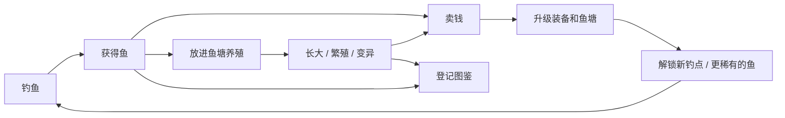

# 钓鱼养鱼游戏 · 策划构思（草案 v0.1）

> 暂定名：《鱼塘物语》（备选：《渔乐田园》《钓鱼小镇》）
> 类型：休闲模拟 / 收集养成
> 核心体验：**钓到好鱼的惊喜 + 把鱼塘越养越好的成就感**，后期扩展种田，形成"钓—养—种—做"的田园生活闭环。

---

## 1. 世界观与开场（顺便为种田埋伏笔）

玩家回到乡下，继承了外公留下的一间老屋、一口荒废的鱼塘，**以及屋旁一块长满杂草的荒地**。

- 开局只能钓鱼 → 攒钱修好鱼塘 → 开始养鱼
- 荒地从第一天起就看得见，但被杂草和石头覆盖，后期版本"开荒"即可解锁种田
- 这样种田不是突兀加进来的新系统，而是玩家一直期待的"下一步"

---

## 2. 核心循环



- **短循环（1~3 分钟）**：抛竿 → 等咬钩 → 遛鱼 → 上鱼
- **中循环（一天）**：钓一轮 → 喂鱼、清理鱼塘 → 卖货 → 接/交订单
- **长循环（数周）**：集齐图鉴、培育稀有锦鲤、解锁深海钓点、扩建鱼塘

---

## 3. 钓鱼系统

### 3.1 操作流程

| 阶段 | 玩法 | 说明 |
|---|---|---|
| 选点 | 看水面 | 水花、气泡、鱼影提示鱼群位置；远处/深处更容易出稀有鱼 |
| 抛竿 | 蓄力条 | 按住蓄力，松开抛出，力度决定距离 |
| 等待 | 看浮漂 | 浮漂轻点是试探，猛地下沉才是咬钩；提早提竿会惊走鱼 |
| 提竿 | 时机判定 | 咬钩后的短窗口内点击，完美时机加成上鱼率 |
| 遛鱼 | **张力小游戏** | 见下文 |

### 3.2 遛鱼小游戏：张力条（单指可操作，手机/PC 通吃）

- 按住 = 收线，张力上升；松开 = 放线，张力下降
- 张力**过高**会断线，**过低**会脱钩，保持在绿色区间内鱼的体力会下降
- 鱼体力归零即上鱼
- 不同鱼有不同"挣扎性格"，让每种鱼手感不一样：
  - **温顺型**（鲫鱼）：张力平稳，新手友好
  - **爆冲型**（鳜鱼、鲈鱼）：突然猛拉，需要及时松手
  - **耐力型**（草鱼、鲶鱼）：力气不大但体力很多，拉锯战
  - **狡猾型**（传说鱼）：会假装力竭再突然爆发

### 3.3 鱼的出现条件

每种鱼由多个条件决定是否出现，玩家需要"研究"才能钓到想要的鱼，这是收集驱动力的核心：

- **钓点**：小溪 / 湖泊 / 河流 / 山涧 / 海边 / 深海 / 冰湖
- **时段**：清晨 / 白天 / 黄昏 / 夜晚
- **天气**：晴 / 雨 / 雾 / 雪 / 雷雨
- **季节**：春夏秋冬
- **饵料偏好**：蚯蚓、面饵、玉米、虾、路亚假饵……
- **重量随机**：同一种鱼有重量区间，打破个人记录本身就是乐趣

### 3.4 首批鱼种示例（MVP 10 种）

| 鱼 | 钓点 | 时段 | 天气 | 稀有度 | 可养殖 | 备注 |
|---|---|---|---|---|---|---|
| 鲫鱼 | 小溪/湖泊 | 全天 | 任意 | 普通 | ✅ | 新手鱼 |
| 麦穗鱼 | 小溪 | 白天 | 任意 | 普通 | ✅ | 小而多，偷饵专家 |
| 泥鳅 | 小溪 | 全天 | 雨 | 普通 | ✅ | |
| 草鱼 | 湖泊 | 白天 | 任意 | 普通 | ✅ | 耐力型 |
| 鲤鱼 | 湖泊 | 全天 | 任意 | 普通 | ✅ | **锦鲤育种的起点** |
| 黄鳝 | 小溪 | 夜晚 | 任意 | 少见 | ✅ | |
| 鲶鱼 | 河流 | 夜晚 | 雨 | 少见 | ✅ | |
| 鳜鱼 | 河流 | 黄昏 | 晴 | 稀有 | ✅ | 爆冲型，高价 |
| 虹鳟 | 山涧 | 清晨 | 晴 | 稀有 | ✅ | 需要冷水鱼塘 |
| 金鳞鲤 | 湖泊 | 满月之夜 | — | 传说 | ❌ | 只能钓一次，进图鉴 |

### 3.5 装备

- **鱼竿**：决定抛投距离、张力上限
- **鱼线**：决定断线阈值
- **渔轮**：决定收线速度
- **鱼钩**：影响脱钩概率
- **饵料 / 窝料**：决定钓哪类鱼；打窝能提高某类鱼出现率（窝料后期可由种田产出）

---

## 4. 养鱼系统

### 4.1 鱼塘

| 属性 | 作用 |
|---|---|
| 容量 | 能放多少条鱼，扩建提升 |
| 水质（0~100） | 鱼越多、喂得越多、越久不清理下降越快；水质低 → 生长慢、生病 |
| 溶氧 | 夏天和夜间偏低，装增氧机解决 |
| 水温 | 跟随季节；冷水鱼（虹鳟）/ 热带鱼需要对应鱼塘 |

### 4.2 鱼的个体数据

每条养殖鱼都是独立个体，而不是"数量+1"：

- 品种、年龄、成长阶段（鱼卵 → 鱼苗 → 幼鱼 → 成鱼）
- 体型/重量、健康、饱食度
- **基因**（花色、体型），用于繁殖遗传

### 4.3 繁殖与育种（长线目标）

- 同种两条成鱼 + 繁殖季节 → 产卵 → 孵化成鱼苗
- 子代继承父母基因，有小概率**变异**
- **锦鲤育种**作为招牌玩法：普通鲤鱼 → 红白 → 大正三色 → 昭和三色 → 黄金锦鲤……花色越稀有越值钱
- 育种给了"养鱼"一个永远有追求的深度

### 4.4 产出

- 成鱼出售（按品种 × 重量 × 品相定价）
- 鱼苗 / 鱼卵出售
- 观赏鱼参展比赛拿奖
- **鱼粪 → 有机肥**（种田伏笔，见第 6 节）

### 4.5 设施（自动化成长线）

增氧机 → 过滤器 → 自动投喂器 → 温控设备 → 观赏水族箱

前期手动喂食、清理，后期逐步自动化，让玩家把精力放在育种和钓稀有鱼上。

---

## 5. 经济与成长

- **货币**：金币（主货币）；可选"声望"用于解锁钓点
- **定价**：`基础价 × 稀有度系数 × 重量系数 × 品相`
- **市场波动**：同一种鱼短时间内卖太多会降价 → 鼓励多样化，防止刷一种鱼
- **技能等级**：钓鱼等级、养殖等级（后期加种植、料理等级），升级解锁新能力
- **图鉴**：钓到/养出过的鱼都记录，含最大重量纪录；集齐奖励
- **NPC 订单**：村民委托，例如"要 3 条 2 斤以上的鲫鱼"，奖励金币 + 好感度，给玩家每天明确的小目标
- **钓点解锁**：小溪 → 湖泊 → 河流 → 山涧 → 海边 → 深海 → 冰湖/洞穴（特殊）

---

## 6. 后期扩展：种田（以及为什么现在就要为它做准备）

种田最大的价值不是"多一个玩法"，而是和钓鱼养鱼**互相喂养**：

| 联动 | 方向 | 例子 |
|---|---|---|
| 鱼菜共生 | 鱼塘 → 田 | 鱼塘水灌溉加速作物生长；鱼粪做肥料 |
| 饲料 | 田 → 鱼塘 | 玉米、豆粕做鱼饲料，比买的便宜/效果好 |
| 饵料 | 田 → 钓鱼 | 翻地挖到蚯蚓；玉米、面粉做饵和窝料 |
| 料理 | 鱼 + 菜 → 菜肴 | 红烧鲫鱼、酸菜鱼…… 可高价卖、交订单，或吃了获得 buff（钓鱼幸运 +10%） |

再往后可继续扩展：畜牧、加工坊（腌鱼、酱菜）、家园装修、钓鱼大赛、好友互访鱼塘。

---

## 7. 技术架构建议（让种田能"插进来"）

### 7.1 关键原则

1. **数据驱动**：鱼、作物、物品、钓点都写在配置表（JSON/表格）里，加新鱼新菜不改代码
2. **通用物品系统**：鱼、饵、种子、作物、菜肴都是 `Item`，只是 `type` / `tags` 不同，背包和商店一套代码搞定
3. **通用生长系统**：鱼的成长和作物的成长本质一样（阶段 + 进度 + 环境条件），抽象成同一个 `Growable`
4. **全局时间系统**：时钟、日期、季节、天气集中管理，钓鱼/养鱼/种田都订阅它
5. **存档带版本号**：以后加种田时能平滑迁移老存档

### 7.2 目录结构示意

```
src/
  core/
    time/        # 游戏时钟、季节、天气
    items/       # 物品定义、背包
    economy/     # 商店、价格、市场波动
    growth/      # 通用生长系统（鱼和作物共用）
    save/        # 存档与版本迁移
    events/      # 事件总线
  features/
    fishing/     # 钓点、抛竿、咬钩、遛鱼
    pond/        # 鱼塘、养殖个体、繁殖遗传
    orders/      # NPC 订单
    farm/        # （预留）种田
    cooking/     # （预留）料理
data/
  fish.json  items.json  spots.json  crops.json(预留)
```

### 7.3 数据示例

```jsonc
// data/fish.json
{
  "id": "crucian_carp",
  "name": "鲫鱼",
  "rarity": "common",
  "spots": ["creek", "lake"],
  "time": ["any"],
  "weather": ["any"],
  "seasons": ["spring", "summer", "autumn", "winter"],
  "baits": { "worm": 1.5, "dough": 1.2 },
  "weightKg": [0.1, 1.5],
  "fight": { "style": "gentle", "stamina": 30, "power": 20 },
  "basePrice": 15,
  "farmable": true,
  "growth": { "stages": ["fry", "juvenile", "adult"], "daysPerStage": [2, 3] }
}
```

```ts
// 鱼和作物共用的生长接口
interface Growable {
  defId: string;       // 对应配置表 id
  stage: number;       // 当前阶段
  progress: number;    // 当前阶段进度 0~1
  tick(dt: GameTime, env: Environment): void; // env: 水质/土壤、温度、季节等
}
```

### 7.4 引擎 / 技术选型

| 目标平台 | 推荐 | 理由 |
|---|---|---|
| 微信 / 抖音小游戏 | **Cocos Creator** + TypeScript | 国内小游戏生态最成熟 |
| PC（Steam） / 多平台 | **Godot 4** | 免费开源，2D 能力强，适合这类游戏 |
| 网页，想最快做出原型 | **Phaser 3** + TypeScript + Vite | 浏览器打开就能玩，迭代最快 |

---

## 8. 开发路线（建议）

| 版本 | 内容 | 目标 |
|---|---|---|
| **v0.1 MVP** | 1 个钓点、10 种鱼、钓鱼全流程（含张力小游戏）、背包、卖鱼、1 口鱼塘（放养/喂食/长大/出售）、本地存档 | 验证"钓鱼手感好不好玩" |
| v0.2 | 时间/天气/季节、图鉴、装备升级、3 个钓点 | 有收集和成长动力 |
| v0.3 | 繁殖与锦鲤育种、NPC 订单、鱼塘设施 | 养鱼有深度 |
| v0.4 | **开荒种田**、鱼菜共生联动、饲料/饵料自产 | 系统闭环 |
| v0.5+ | 料理、家园装修、钓鱼比赛、社交 | 长线内容 |

> 原则：**先把钓鱼手感打磨好**。这类游戏玩家 80% 的时间都在抛竿遛鱼，手感不好，后面系统再多也留不住人。

---

## 9. 待决策问题

1. **目标平台**：小游戏 / 手机 App / PC / 网页？（决定引擎）
2. **时间模型**：
   - *游戏内时间*（类似星露谷）：一天 = 现实 15~20 分钟，适合 PC 单机、沉浸式
   - *现实时间*（类似 QQ 农场）：鱼和作物按真实时间生长，有离线收益，适合手机碎片化和社交"偷菜"
3. **画风**：像素风 / 卡通手绘 / 低多边形 3D？
4. **视角**：俯视角（能走动的小镇）还是固定场景（点击切换钓点）？固定场景开发量小很多
5. **是否联网**：纯单机，还是要排行榜、好友互访？
