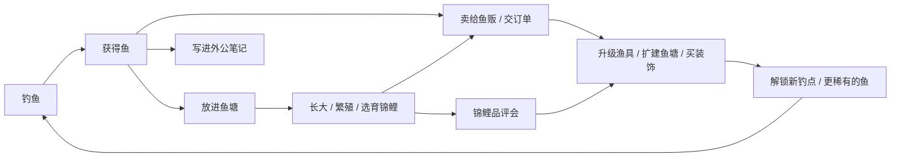
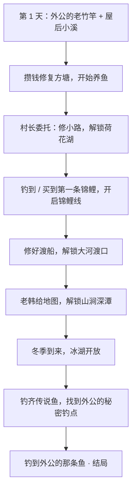

# 《半亩方塘》游戏策划大纲 v0.3

> **暂定名**：《半亩方塘》——出自朱熹"半亩方塘一鉴开，天光云影共徘徊"。
> "方塘"对应养鱼，"半亩"暗含日后种田，诗句本身的清澈、宁静也正是想要的画面气质。（上线前需在 Steam 和商标库查重。）
>
> 相关文档：
> - [技术方案与分工](production-plan.md)：怎么做、谁来做、先做什么
> - [美术与音频指南](art-audio-guide.md)：可以直接交给图像 AI / 音乐 AI / 画师的风格说明、资源清单和提示词

---

## 0. 已确定的方向

| 项目 | 决定 | 状态 |
|---|---|---|
| 平台 | PC，发行在 Steam | ✅ 已定 |
| 时间模型 | 游戏内时间（一天约 15 分钟） | ✅ 已定 |
| 联网 | 纯单机（Steam 成就、云存档照常支持） | ✅ 已定 |
| 画风 | 国风治愈 · 扁平水彩插画（见第 2 节） | ✅ 已定 |
| 主角 | **一只可以自由行走的奶牛猫**，形象来自 Miao.Club 的猫（见第 4 节） | ✅ 已定 |
| 视角 | **3/4 俯视探索**（像星露谷、动森）+ **正俯视观鱼**（参考图那样的画面）（见第 5 节） | 🟡 建议，待确认 |
| 世界 | **拟人小动物的村子**，NPC 都是动物（见第 11 节） | 🟡 建议，待确认 |
| 技术栈 | TypeScript + PixiJS + Electron（理由见技术方案） | 🟡 建议，待确认 |

---

## 1. 游戏概述

**一句话**：一只城里来的酷猫回到乡下外公的老宅，在溪边湖畔钓鱼，把荒废的方塘养成一池锦鲤，最终钓到外公一生都没钓到的那条鱼。

**三条设计支柱**（所有系统设计都要对照这三条）：

1. **看着就舒服**：鱼塘本身就是一幅会动的画。什么都不做、只是看鱼游，也是一种享受。
2. **每一竿都有期待**：鱼影是大是小、是什么鱼、会不会破纪录，永远有一点悬念。
3. **养出独一无二的鱼**：每条锦鲤的花纹都由基因生成、不会重复，是"我亲手培育"的那条。

**治愈向底线**：没有体力条、鱼不会死（只会生病和停止生长）、熬夜不惩罚、没有失败结局。压力只来自玩家自己想要的目标。

---

## 2. 画风：不是宫崎骏，是"国风扁平水彩"

参考图（碧潭观鱼）不是宫崎骏（吉卜力）风格：

| | 吉卜力 / 宫崎骏 | 参考图的风格 |
|---|---|---|
| 造型 | 细腻手绘、细节丰富 | 扁平、简洁、几乎无描边 |
| 光影 | 强烈的暖光、云影、厚涂 | 柔和漫射光，没有强高光 |
| 色彩 | 饱满的绿、蓝、暖黄 | 低饱和、偏灰的青绿（接近莫兰迪色） |
| 质感 | 水彩背景 + 动画赛璐璐人物 | 整体带水彩 / 水粉颗粒和纸张纹理 |
| 气质 | 日式田园、奇幻 | 新中式、极简、安静 |

比较准确的叫法是 **"国风治愈 · 扁平水彩插画"**。

**鱼、水波、光斑、天气都可以用代码程序化绘制**，每条锦鲤的花纹由基因自动生成。场景物件、角色需要画师或图像 AI 来画。具体规则见[美术与音频指南](art-audio-guide.md)。

### 2.1 猫的形象需要"游戏版"改造

你设计的猫是**粗黑描边、日漫贴纸风**，和鱼塘的**无描边、低饱和水彩风**放在一起会打架。建议分两个版本：

| 版本 | 用途 | 风格 |
|---|---|---|
| **品牌版**（现在这张） | Miao.Club 标志、Steam 头像、周边、贴纸 | 保持原样 |
| **游戏版**（重新绘制） | 游戏里行走的主角、对话立绘 | 保留全部设计要素，改成游戏画风：描边变细、改为深色而非纯黑，毛发简化成色块，颜色往游戏色板靠 |

角色保留细描边是游戏里的常用做法，能让角色从背景里"跳"出来，一眼就看到自己在哪。

> ⚠️ 参考作品只借鉴风格。它的界面布局、文案、功能设计要避免照搬，也不要把它的截图喂给图像 AI 当参考图。

---

## 3. 世界观与故事

- **舞台**：南方山间的小村 **柳溪村**（暂定），住着各种拟人的小动物。村里有溪、有荷塘、有大河渡口，四季分明。时代是现代，带一点怀旧感。
- **主角**：一只奶牛猫，默认名 **阿喵**（玩家可以改名），在城里过惯了快节奏的生活。
- **开场**：猫外公去世后，阿喵回到老宅。屋后的方塘早已干涸长草，旁边还有一块荒地。阿喵在屋里找到外公留下的**草帽、打着补丁的旧外套、一根老竹竿**，还有一本**钓鱼笔记**。
  - **造型由来**：墨镜是阿喵自己从城里带来的，草帽、外套、竹竿都是外公的。"城里的酷"加上"外公的旧物"，就是主角的标志造型。
- **主线**：外公笔记既是图鉴，也是故事线。笔记里记着每一种鱼的线索，最后几页写着几条"传说中的鱼"，其中一条外公钓了一辈子都没钓到。
- **结局**：钓到"外公的那条鱼"后，玩家可以选择放生它。游戏在结局后继续，没有终点。
- **种田伏笔**：荒地从第一天起就在老宅旁边，被杂草和石头覆盖。后期版本开荒即可种田（见第 14 节）。

---

## 4. 主角：阿喵

### 4.1 设计要素（游戏版必须保留）

参考：[`assets/reference/cat-brand.webp`](../assets/reference/cat-brand.webp)

| 要素 | 细节 |
|---|---|
| 毛色 | 奶牛猫：头顶和耳朵黑色，脸下半部和胸口白色，**白手套爪子**，粉鼻子，耳朵内侧粉色 |
| 墨镜 | 黑色方框墨镜，**标志性元素，一直戴着** |
| 草帽 | 编织草帽，帽檐有磨损破口 |
| 外套 | 靛蓝色外套，袖子上有一块灰色补丁 |
| 内衫 | 米白色中式立领衫，深蓝色盘扣 |
| 鱼竿 | 竹制鱼竿，缠着绳结，红白浮漂 |
| 秧苗 | 手里的一捆秧苗，**正好对应后期"稻鱼共生"的种田玩法** |
| 神态 | 淡定、高冷、面无表情 |

一个小彩蛋：奶牛猫的黑白配色和"白写"锦鲤一模一样，可以做一个隐藏锦鲤品种"喵纹"。

### 4.2 性格

表面淡定高冷，其实看到鱼就挪不动步。做成待机小动作：盯着锦鲤看、偷偷舔嘴。

> 小满："你是猫，为什么不吃自己养的锦鲤？"
> 阿喵："外公说过，好鱼是用来看的。"

### 4.3 猫咪专属能力

| 能力 | 效果 |
|---|---|
| **胡须感应** | 附近有稀有鱼时胡须会抖动，钓鱼等级越高感应越准 |
| **打盹** | 在长椅、屋檐下、晒太阳的地方打个盹，快进一段时间（比如等到黄昏出鱼） |

### 4.4 需要的动作

墨镜挡住了眼睛，**情绪全靠耳朵、尾巴和嘴巴表达**，因此不需要做眼睛动画，能省不少工作量。

| 类别 | 动作 |
|---|---|
| 移动 | 行走（4 个方向）、小跑 |
| 待机 | 呼吸、甩尾；随机小动作：舔爪、伸懒腰、打哈欠、盯鱼 |
| 钓鱼 | 抛竿、坐着等鱼、提竿、遛鱼拉扯、**举鱼**（上鱼的高光时刻）、断线失落 |
| 鱼塘 | 撒饲料、捞网 |
| 其他 | 打盹、开心、惊讶 |
| 种田（后期） | 锄地、浇水、插秧、收割 |

动画用"拆件 + 代码骨骼动画"实现（见技术方案），画师只需要画出三个朝向的拆件，不用逐帧画。

---

## 5. 游戏结构

### 5.1 视角：两种镜头

| 镜头 | 用在哪里 | 效果 |
|---|---|---|
| **探索视角（3/4 俯视）** | 家园、村子、各钓点 | 类似星露谷、动森：地面从上往下看，树、房子、角色能看到正面。阿喵用键盘 WASD 或手柄自由行走 |
| **观鱼视角（正俯视近景）** | 在鱼塘边按一个键进入 | 镜头拉近到正上方，隐藏界面，就是参考图那样的画面 |

两种视角下水面都是从上往下看的，所以水里的鱼、鱼影、波纹用的是**同一套渲染技术**。

### 5.2 世界结构

- **几张相连的地图**：老宅（家园）、柳溪村、各钓点。走到地图边缘切换到下一张；去过的地方可以打开地图快速前往，同样消耗游戏时间。
- **不做可行走的室内**，以减少美术量：
  - 老宅室内是一张插画，点击床（睡觉存档）、收音机（天气预报）、外公笔记、奖杯架。
  - 村子是露天集市，店铺都是摊位，走过去对话就能买卖。

### 5.3 时间

| 项目 | 设定 |
|---|---|
| 一天 | 6:00 → 次日 2:00 |
| 流速 | 1 游戏小时 ≈ 45 现实秒，**一天约 15 分钟**（设置里可调 0.5× ~ 2×） |
| 暂停 | 打开菜单、对话、上鱼展示时，时间暂停 |
| 熬夜 | 到 2:00 阿喵原地睡着，第二天在家醒来，**没有惩罚** |
| 睡觉 | 触发每日结算：鱼塘生长和繁殖、水质变化、钓点鱼情恢复、订单刷新、写鱼塘日志 |
| 季节 | 每季 14 天，一年 56 天（可调） |
| 天气 | 晴 / 多云 / 雨 / 雷雨 / 雾 / 雪（冬），老宅里的**旧收音机**能听到明天的天气预报 |

时间本身就是资源：清晨、黄昏、夜里出的鱼不同，下雨天有的鱼特别活跃。

### 5.4 一天的样子（示例）

> 6:00 阿喵醒来，打开收音机：明天有雷雨，大河的"墨鲤"可能会出现 →
> 6:30 走到屋后喂锦鲤、捞落叶 → 7:00 沿小路走到溪边，钓清晨的马口鱼 →
> 11:00 到村里集市，把鱼卖给水獭周叔，在公告栏交一个订单 →
> 午后在荷花湖边钓鱼，胡须突然一抖，钓到一条别人放生的红白锦鲤！→
> 下午在湖边长椅上打个盹 → 18:00 回家，把锦鲤放进池子，起名"小红" →
> 21:00 带着夜光漂去溪边夜钓黄鳝 → 1:00 回家睡觉，看鱼塘日志

---

## 6. 核心循环

- **短循环（1~3 分钟）**：观察鱼影 → 抛竿 → 诱鱼 → 咬钩 → 遛鱼 → 上鱼
- **中循环（一天）**：安排行程 → 钓鱼 → 卖货交订单 → 喂鱼 → 睡觉结算
- **长循环（数周）**：补全外公笔记、培育顶级锦鲤、解锁新钓点、钓传说鱼

---

## 7. 钓鱼系统

### 7.1 流程

| 步骤 | 玩法 | 技巧空间 |
|---|---|---|
| **1. 找位置** | 阿喵走到岸边、面朝水面。水里只看得到鱼的**影子**，按大小分为小 / 中 / 大 / 巨四档；水花、气泡提示鱼群；浅滩、深水、水草、石缝出的鱼不同 | 认影子、找好位置 |
| **2. 抛竿** | 鼠标指向目标点，按住蓄力，松开抛出，阿喵做抛竿动作；落点有随机偏差（竿越好越准） | 抛在鱼的前方而不是头顶，**砸到鱼头会把它吓跑** |
| **3. 诱鱼** | 阿喵坐下等鱼，尾巴轻轻甩。鱼察觉饵料后游过来，绕饵、试探（浮漂轻颤），最后咬钩（浮漂猛沉 + 提示音） | 饵料对不对胃口，决定鱼来不来 |
| **4. 提竿** | 咬钩后的短暂窗口内点击；太早提竿会惊走鱼 | 狡猾的鱼窗口更短 |
| **5. 遛鱼** | 镜头稍微拉近，张力小游戏（见 7.2）。阿喵后仰拉竿，水里的鱼影拖着鱼线乱窜 | 核心手感 |
| **6. 上鱼** | 阿喵**把鱼高高举起**，弹出鱼的卡片：名称、重量、稀有度，提示"新纪录""笔记新页"；选择**放进鱼护**或**放生** | |

"举鱼"是整个游戏最常出现的高光画面，也是玩家最常截图分享的瞬间，动作要做得有趣。

### 7.2 遛鱼：张力小游戏

- **按住左键**收线：张力上升，鱼体力下降更快。**松开**放线：张力下降。
- 张力太高会断线，太低会脱钩，保持在安全区间里鱼会逐渐没力。
- **进阶技巧**：鱼往左冲时把鼠标往右拉（控竿方向），能大幅降低张力。新手可以不管，高手能更快上鱼。
- 鱼体力归零 → 拉到岸边 → 上鱼。

不同的鱼有不同的挣扎方式：

| 挣扎方式 | 手感 | 代表鱼 |
|---|---|---|
| 温顺 | 张力平稳，新手友好 | 鲫鱼、麦穗鱼 |
| 爆冲 | 突然猛拉，要及时松手 | 鳜鱼、黑鱼、翘嘴 |
| 耐力 | 力气不大但体力很多，拉锯战 | 草鱼、青鱼、鲶鱼 |
| 钻底 | 往水草、石缝里钻，要侧向控竿 | 黄鳝、黄颡鱼 |
| 狡猾 | 假装没力气再突然爆发 | 传说鱼 |

### 7.3 鱼的出现条件（全部写在配置表里）

- **钓点**和**区域**（浅滩 / 深水 / 水草 / 石缝）
- **时段**：清晨 / 白天 / 黄昏 / 夜晚
- **天气**、**季节**
- **饵料偏好**：蚯蚓、面饵、玉米、红虫、河虾、路亚假饵……
- **重量区间**：同种鱼也有大有小，破纪录就是乐趣

外公笔记里每种鱼都有一句线索，比如"端午前后的傍晚，荷塘东边柳树下，用玉米"。玩家不用查攻略，**看笔记就能推理**。

### 7.4 鱼护与鱼情

- **鱼护**：活鱼暂存在鱼护里，容量有限（初始 8 条，可升级），回家时决定哪些放进鱼塘、哪些卖掉。
- **鱼情**：每个钓点有"鱼情值"。一天钓得太多，鱼情下降、鱼变少，几天后恢复；放生能减缓下降。这样鼓励玩家轮换钓点，也和"放生"的温柔气质呼应。
- **杂物**：偶尔钓上外公遗落的旧物（旧烟斗、生锈的鱼钩盒），这些是剧情道具。

### 7.5 渔具

| 渔具 | 影响 | 成长线（示例） |
|---|---|---|
| 鱼竿 | 抛投距离、精度、张力上限 | 外公的老竹竿 → 碳素竿 → 老韩手作竿 → 外公的珍藏竿（剧情） |
| 鱼线 | 断线阈值 | 普通线 → 耐磨线 → 大物线 |
| 浮漂 | 咬钩提示清晰度 | 红白漂（初始）→ **夜光漂（夜钓必备）** → 灵敏漂（小鱼咬钩更明显） |
| 鱼钩 | 脱钩概率 | |
| 饵料 | 决定吸引哪类鱼 | 买 / 挖（后期种田自产） |
| 窝料 | 打窝后一段时间内某类鱼出现率提高 | 后期可用自种的玉米、豆子做 |

### 7.6 钓点与鱼种（1.0 目标约 40 种）

**原则**：不出现国家重点保护水生野生动物，不出现长江十年禁渔相关鱼种，传说鱼全部虚构。

| 钓点 | 解锁 | 代表鱼（示例） | 传说鱼 |
|---|---|---|---|
| 屋后小溪 | 初始 | 鲫鱼、麦穗鱼、泥鳅、白条、马口鱼、黄鳝（夜）、溪蟹 | 青鳞（春夜、细雨） |
| 荷花湖 | 修好小路 | 鲤鱼、草鱼、鲢鱼、鳙鱼、鳊鱼、黑鱼、翘嘴、**被放生的锦鲤（稀有）** | 金鳞（满月夜） |
| 大河渡口 | 渡船 | 鲶鱼、鳜鱼、鲈鱼、青鱼、黄颡鱼、鳡鱼 | 墨鲤（雷雨夜） |
| 山涧深潭 | 老韩给的地图 | 虹鳟、光唇鱼、溪石斑 | 玉鳟（雾晨） |
| 冰湖 | 仅冬季 | 冰钓鲫鱼、鳙鱼、河鲈、狗鱼 | 雪鲈（大雪天） |
| 外公的秘密钓点 | 主线后期 | —— | **外公的那条鱼**（最终） |

冰湖可以做成"凿冰洞"的变体玩法。海边钓点留作后期扩展。

---

## 8. 鱼塘系统

### 8.1 鱼塘的成长

- 开局：修复干涸的方塘（需要攒钱），得到一口混养塘。
- 扩建后分为三类：
  - **锦鲤池**：观赏、育种、参加品评会，是游戏的"门面"。
  - **经济塘**：养草鱼、鲫鱼等，稳定卖钱。
  - **苗池**：繁殖孵化、挑选鱼苗。

### 8.2 鱼塘属性

| 属性 | 作用 |
|---|---|
| 容量 | 按水体大小计算，大鱼占的容量更多 |
| 水质（0~100） | 鱼多、剩饵多、久不清理就会下降；水草、过滤器、换水能提升 |
| 溶氧 | 夏天和夜里偏低，增氧泵解决 |
| 水温 | 跟随季节；冬天鱼几乎不吃不长，符合真实 |

### 8.3 每一条鱼都是个体

每条鱼有：品种、名字、年龄、成长阶段（鱼卵 → 鱼苗 → 幼鱼 → 成鱼）、体长和重量、健康、饱食度、**基因**、父母。

每日生长 = 基础速度 × 饱食系数 × 水质系数 × 水温系数

### 8.4 鱼塘里能做的事

阿喵站在塘边就能操作，也可以切到观鱼视角操作：

- **撒饲料**：点击水面撒一把，鱼群围过来抢食。
- **点鱼**：弹出这条鱼的卡片，显示名字、品种、体长、品相分、父母。
- **捞网**：把选中的鱼移到别的池、卖掉或送人。
- **清理**：捞起秋天的落叶、夏天的水藻。
- **摆装饰**：见第 10 节。
- **治病**：水质长期太差，鱼身上会出现白点、游得变慢，买药治好。鱼不会死。

### 8.5 设施（逐步自动化）

增氧泵 → 过滤器 → 自动投喂器 → 遮阳网（夏）→ 保温棚（冬）

前期手动喂食、清理，有生活感；后期逐步自动化，让玩家把精力放在钓鱼和育种上。

---

## 9. 锦鲤育种（长线核心）

### 9.1 基因模型（设计层，具体算法在代码实现）

| 基因 | 表现 | 关联品种 |
|---|---|---|
| 底色 | 白 / 黄 / 黑 / 红 / 茶 / 银灰 | 所有品种的基础 |
| 红斑（绯） | 覆盖率、斑块大小、边缘清晰度 | 红白、三色 |
| 墨斑 | 覆盖率、分布位置（身上 / 贯穿头部） | 大正三色、昭和三色、白写 |
| 光泽 | 无 / 金属光 | 黄金、白金 |
| 鳞型 | 全鳞 / 德国鳞（背部一排大鳞）/ 网纹鳞 | 秋翠、浅黄、落叶 |
| 体型 | 纺锤 / 丰满 / 细长 | 品评分 |
| 鳍 | 普通 / 长鳍 | 稀有外观 |
| 丹顶 | 只有头顶一个红圆（隐性、稀有） | 丹顶，品评会最高分潜力 |

**品种由外观规则自动判定**：白底 + 红斑 = 红白；再加少量墨斑 = 大正三色；黑底 + 红 + 白 = 昭和三色；全身金属黄 = 黄金……约 15 个品种，外加隐藏品种"喵纹"，而每一条鱼的具体花纹都不一样。

### 9.2 繁殖流程

1. **配对**：春季和初夏是繁殖季，在苗池里选两条成年锦鲤，放入鱼巢。
2. **产卵孵化**：几天后孵出一窝约 20 条鱼苗。
3. **花纹显现**：鱼苗几乎是纯色的，随着长大，花纹逐渐"浮现"。
4. **选别**（真实锦鲤养殖里的重要环节）：花纹初显时挑出最有潜力的几条留下，其余卖给鱼苗贩子或放进经济塘。
5. **遗传**：连续性状取父母之间的值再加随机浮动，部分性状有显隐性，约 1%~3% 的概率发生变异。养殖等级越高，越能预测子代的花纹概率。

### 9.3 品相与品评会

- **品相分（0~100）**：体型、色质（红的浓淡、白的纯净）、花纹（平衡感、边缘、头部花纹）、大小。
- **品评会**：每季最后一天在镇上举行，按体长分组；获奖得奖金、声望、奖杯（可摆在家里）。冬季大赛是年度总决赛。
- **锦鲤来源**：从锦鲤藏家林先生那里买第一条，或在荷花湖小概率钓到别人放生的锦鲤。钓到第一条锦鲤时开启锦鲤线。

---

## 10. 观鱼与装饰

- **观鱼视角**：在塘边一键进入正俯视近景，隐藏所有界面，只剩鱼塘、环境声和音乐，可以当作放松或工作时的背景。（后期评估是否加"桌面小窗置顶"模式，Steam 上这类桌面挂机游戏很受欢迎。）
- **装饰**：睡莲、荷花、菖蒲、石灯笼、小石桥、汀步、假山、竹筒流水（惊鹿）、水车、乌龟……大部分纯观赏，少量有功能（水草改善水质、荷叶在夏天遮阳降温）。
- **鱼塘日志**：每天结算时自动生成几条趣事，比如"小红今天抢到了最多的鱼食""新孵出 18 条小鱼""一只白鹭在塘边站了一下午""阿喵在塘边盯着鱼看了整整一小时"。开发成本低，但很有陪伴感。
- **季节和天气表现**：雨滴涟漪、春天落花、秋天落叶、冬天结薄冰、夏夜萤火虫。这些全部用粒子和着色器实现，不需要额外美术。
- **自绘锦鲤**（可选，后期）：在鱼身上画自己的花纹放进池里。只能观赏，不参与繁殖和买卖，避免破坏育种系统。

---

## 11. 柳溪村、NPC 与订单

整个村子住的都是拟人的小动物，每个 NPC 的物种都和身份相关。NPC 控制在 6 个左右，平时站在自己的摊位或固定地点（只做待机动作，不做行走），对话时显示立绘。

| NPC | 物种（建议） | 身份 | 功能 |
|---|---|---|---|
| 周叔 | 水獭 | 鱼贩 | 收鱼，每天报价不同 |
| 阿婆 | 仓鼠（爱囤货） | 杂货铺 | 饵料、饲料、药品（后期卖种子） |
| 老韩 | 苍鹭（捕鱼高手） | 渔具匠，外公的老钓友 | 渔具升级；讲外公的往事；给山涧地图 |
| 小满 | 小柴犬 | 邻居家的孩子 | 新手引导；出图鉴挑战（"你能钓到比我还大的鲫鱼吗？"） |
| 林先生 | 丹顶鹤（和"丹顶"锦鲤呼应） | 城里来的锦鲤藏家 | 卖第一条锦鲤；高价收购精品锦鲤；品评会引路人 |
| 村长 | 老水牛 | 村长 | 公告栏订单；出钱修路、修渡船，解锁钓点 |

- **订单**：公告栏每天 1~3 个委托，比如"要 3 条 2 斤以上的鲫鱼""要一条品相 70 分以上的红白"。奖励有钱、好感、特殊饵料、装饰、配方。
- **好感**：轻量设计。送鱼能提升好感，好感高了能解锁折扣、剧情和特殊商品。

---

## 12. 经济与成长

- **货币**：元（现代背景，简单直白）。
- **定价**：`基础价 × 稀有度系数 × 重量系数 × 品相系数`
- **市场波动**：周叔每天的收购价有浮动，同一种鱼当天卖多了会降价，鼓励多样化。
- **技能等级**：
  - 钓鱼等级：提升抛投精度和胡须感应范围；高等级能从影子看出鱼的类别。
  - 养殖等级：解锁设施；高等级能预测繁殖结果。
  - （后期）种植等级、料理等级。
- **解锁主线（示例）**：

---

## 13. 外公笔记（图鉴）与成就

- **笔记就是图鉴**：每种鱼一页，一开始只有外公手写的线索批注；钓到后补全插画、最大纪录、首次钓到的日期。
- **传说鱼页面**：只有外公的只言片语和几张潦草的速写，驱动玩家去探索。
- **锦鲤页**：记录玩家培育出的每一个品种，以及自己最得意的几条鱼。
- **Steam 成就（约 30 个）**：第一条鱼、笔记完成 25% / 50% / 100%、第一次繁殖、培育出丹顶、培育出喵纹、品评会冠军、钓齐 5 条传说鱼、结局……

---

## 14. 后期扩展：种田（围绕"水"与鱼塘共生）

阿喵手里那捆秧苗，正好点明了种田的方向：**用中国传统的生态农法作为核心玩法**，和星露谷式的种田拉开差异。

| 联动 | 玩法 |
|---|---|
| **稻鱼共生**（招牌玩法） | 插秧后在稻田里放养鱼苗：鱼吃虫除草、鱼粪肥田，水稻增产，秋收时还能收获一批"稻花鱼" |
| **桑基鱼塘** | 塘边种桑 → 桑叶养蚕 → 蚕沙喂鱼 → 塘泥肥桑，形成循环 |
| 鱼菜共生 | 用鱼塘水灌溉，作物长得更快 |
| 自产饲料和饵料 | 玉米、豆子做鱼饲料和窝料；翻地挖到蚯蚓；小麦磨面做面饵 |
| 料理 | 鱼 + 菜做成菜肴，可以卖钱、交订单，吃了还能获得加成（比如钓鱼幸运 +10%） |

稻鱼共生和桑基鱼塘都是被列入"全球重要农业文化遗产"的传统农法，既有文化底蕴，也是很好的宣传点。

有了可行走的主角，种田就是标准玩法：阿喵走到田块上锄地、插秧、浇水、收割。技术上复用现有系统：田块用地图网格，作物和鱼共用"生长系统"，种子、作物、菜肴都是物品，时间和季节现成。

---

## 15. 品牌

- **工作室 / 品牌名**：Miao Club，官网 miao.club。
- **阿喵**同时是游戏主角和品牌吉祥物。品牌版形象用于标志、Steam 开发者主页、社交媒体和周边，游戏版形象用于游戏内。
- 游戏里的"喵"音效（上鱼时的一声满足的喵）可以作为品牌的声音标识。

---

## 16. 内容规模（1.0 目标）

| 内容 | 数量 |
|---|---|
| 地图 | 老宅、柳溪村、5 个钓点、1 个秘密钓点，共 8 张 |
| 鱼种 | 约 40 种（含 6 条传说鱼） |
| 锦鲤品种 | 约 15 种 + 隐藏品种，个体花纹无限 |
| 主角动作 | 约 20 个（见 4.4） |
| NPC | 6 个 |
| 渔具 | 约 20 件 |
| 装饰 | 约 40 件 |
| 背景音乐 | 10~12 首 |
| 成就 | 约 30 个 |
| 通关时长 | 主线 20~30 小时，全收集 50 小时以上 |

版本路线和里程碑见[技术方案与分工](production-plan.md)。

---

## 17. 主要风险

| 风险 | 应对 |
|---|---|
| **主角的游戏版形象和动画**（美术上最重要、也最难的一项） | 主角建议请画师画三视图和拆件，动画由代码实现；画师到位前先用占位猫开发 |
| 程序化绘制的鱼能否达到参考图的质感 | 第一步（M0）先做技术验证 |
| 图像 AI 出图风格不统一 | 先定一张主视觉，其余全部以它为风格参考；游戏内再加统一调色 |
| 钓鱼手感不好玩 | 尽早做出钓鱼原型，找人试玩，反复打磨 |
| 内容太多做不完 | 严格按里程碑推进，1.0 之前不做种田；不做室内地图 |

## 18. 待确认

1. 视角方案（3/4 俯视探索 + 正俯视观鱼）是否认可？
2. 拟人动物村、NPC 物种安排是否认可？
3. 主角默认名"阿喵"、村名"柳溪村"是否喜欢？
4. 技术栈 TypeScript + PixiJS + Electron 是否认可？
5. 游戏名《半亩方塘》是否保留？
6. 是否需要支持手柄 / Steam Deck？（有了行走主角，支持手柄会更自然）
