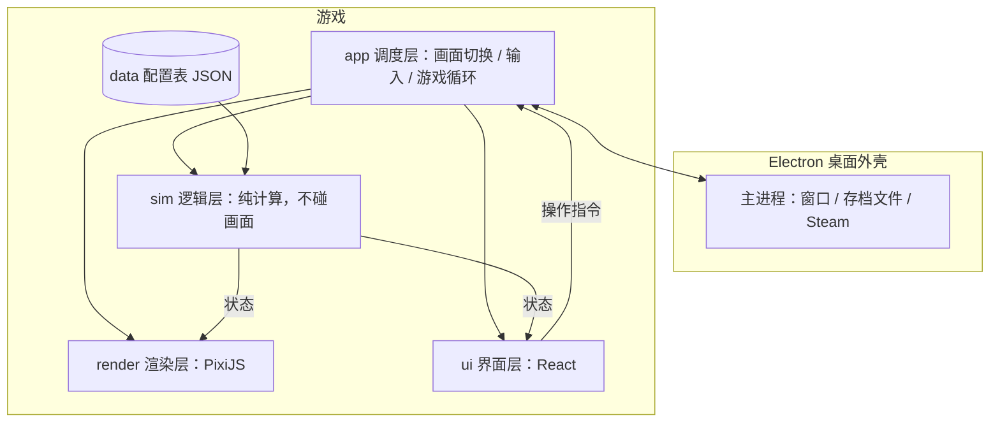

# 技术方案与分工

> 配套文档：[策划大纲](game-design.md) · [美术与音频指南](art-audio-guide.md)
>
> **当前路线**：先做方案 B（场景式，阿喵在场但不走动），以后升级为方案 C（可自由行走）。见策划大纲第 5 节。

---

## 1. 技术选型

### 1.1 推荐方案

| 部分 | 选择 | 作用 |
|---|---|---|
| 语言 | TypeScript | 全部游戏代码 |
| 渲染 | PixiJS v8 | 2D 画面：水面、鱼、阿喵、粒子、着色器 |
| 界面 | React + CSS | 背包、商店、笔记、鱼卡片等所有面板 |
| 桌面外壳 | Electron | 打包成 Windows / macOS 程序，读写存档（开发期先在浏览器里跑，M2 前后接入） |
| Steam 接入 | steamworks.js | 成就、云存档、Steam 界面 |
| 音频 | Howler.js | 背景音乐循环、音效 |
| 构建 | Vite | 开发时热更新，秒级看到改动 |
| 测试 | Vitest（逻辑）+ Playwright（画面截图） | 自动化验证 |
| 数据校验 | zod | 检查配置表有没有写错 |
| 地图编辑（方案 C） | Tiled（免费地图编辑器） | 摆放地形和物件，导出 JSON |

### 1.2 为什么不用之前建议的 Godot

之前按"PC 游戏"的常规思路推荐了 Godot 4。但这个项目的实际情况是**代码主要由 AI 来写**，这一点改变了结论：

1. **AI 最擅长 TypeScript**。Godot 4 的 GDScript 资料少得多，AI 还经常把 Godot 3 和 4 的写法搞混，出错率明显更高。
2. **全部是纯文本代码**。Godot 的很多工作要在编辑器里拖拽完成；这套方案没有这一步，任何 AI 都能改，改了什么在 git 里一目了然。
3. **我能自己验收画面**。我在云端环境里能直接运行游戏、截图、跑自动测试，自己检查"鱼好不好看、帧率够不够"。Godot 在这种环境里很难做到。
4. **界面更容易做漂亮**。纸质卡片、宋体排版的界面，用网页技术（HTML/CSS）做最自然。
5. **路线成熟**。用网页技术做 2D 游戏上 Steam 已经有很多先例，比如《吸血鬼幸存者》最初就是用 Phaser + Electron 做的。

**以后升级到方案 C 结论也不变**：行走地图、碰撞、镜头跟随、前后遮挡都是 2D 游戏的常规功能，代码量不大；地图用 Tiled 编辑，导出的就是 JSON。

**代价**：安装包大一些（约 150MB，对 Steam 游戏无所谓）；性能不如原生引擎，但对这种规模的 2D 游戏完全够用；以后想上主机平台会比较麻烦（我们只做 PC，没影响）。

---

## 2. 架构



### 2.1 四条硬规则

1. **逻辑层（sim）不能引用任何画面代码**。时间、天气、鱼的生长、遗传、经济、钓鱼判定全部是纯计算，所有随机数用可设种子的随机数生成器。这样逻辑可以脱离画面单独测试，也能跑几百天的数值模拟来调平衡。
2. **所有内容写在配置表里**。鱼、渔具、钓点、钓位、订单、NPC 对话都在 `data/` 目录的 JSON 文件里，用 zod 校验，加新鱼不改代码。
3. **界面只读状态、只发指令**。界面不直接修改游戏数据，所有改动通过指令交给逻辑层，避免状态混乱。
4. **存档带版本号**。每次存档结构变化都要写迁移函数，保证老存档永远能打开（升级到方案 C、加种田时尤其重要）。

### 2.2 为升级到方案 C 预留的边界

- 每个画面（钓鱼、鱼塘、场景插画、地图）都是独立的"场景"，进入时只接收一个参数，比如"哪个钓点的哪个钓位"。
- 逻辑层只记录"阿喵现在在哪个地点"和"移动花了多少游戏时间"，不关心是点地图过去的还是走过去的。
- 升级到 C 时，只需要新增"行走地图"这一种场景：走到钓位按交互键，就用同样的参数打开钓鱼画面。钓鱼、鱼塘、育种、经济、时间的代码都不用动。

### 2.3 目录结构

```
electron/            # 桌面外壳：窗口、存档读写、Steam 接入
src/
  sim/               # 逻辑层（纯 TypeScript，可单独测试）
    time/            #   游戏时钟、季节、天气
    rng/             #   可设种子的随机数
    items/           #   物品与背包
    fishing/         #   鱼的出现、咬钩、遛鱼判定
    pond/            #   鱼塘、个体生长、水质
    genetics/        #   锦鲤基因、遗传、品种判定、品相评分
    economy/         #   价格、市场波动、订单
    save/            #   存档结构与版本迁移
  render/            # 渲染层（PixiJS）
    water/           #   水面着色器：池底、焦散光斑、波纹
    fish/            #   程序化鱼：身体网格、摆尾、花纹贴图、投影
    flock/           #   群游算法
    cat/             #   俯视阿喵的拆件动画
    fx/              #   雨、雪、落叶、萤火虫
  scenes/            # 各个画面：鱼塘、钓鱼、场景插画、地图（方案 C 再加行走地图）
  ui/                # 界面层（React）：HUD、面板、对话
  app/               # 调度层：画面切换、输入、游戏循环
  audio/             # 音乐、音效
data/                # 配置表：fish.json、spots.json、items.json……
assets/
  reference/         # 设计参考（猫的品牌形象等）
  raw/               # 画师和其他 AI 交付的原始素材（你放这里）
  ...                # 处理后、游戏实际使用的素材（我放这里）
tools/               # 截图脚本、数值模拟脚本、素材批处理脚本
tests/
docs/
```

### 2.4 关键技术点

| 技术点 | 做法 | 风险 |
|---|---|---|
| 水面 | 池底图（正式图到位前用程序生成的占位池底）+ 焦散光斑着色器 + 点击 / 雨滴波纹 | 中，M0 验证 |
| 鱼 | 沿脊柱变形的网格实现摆尾，程序生成的花纹贴图，偏移的柔和投影 | **高，M0 重点验证** |
| 群游 | 群体算法（分离 / 对齐 / 聚合）+ 空间网格加速，目标 200 条鱼稳定 60 帧 | 低 |
| 俯视阿喵 | 拆件挂在代码写的骨骼上：呼吸起伏、尾巴按正弦摆动、耳朵随情绪转动、抛竿和拉竿时手臂和竹竿联动 | 中，M0 占位、M1 验证 |
| 钓鱼画面 | 鱼影游动与诱饵行为、抛竿弧线、鱼线（带下垂的曲线）、竹竿按张力弯曲、浮漂的轻颤和下沉 | 中，M1 验证 |
| 钓鱼手感 | 张力、体力、挣扎模式全部参数化，内置调参面板，边玩边调 | 中，需要人试玩 |
| 场景插画 | 一张插画 + 若干可点击的热点区域（鼠标移上去高亮），NPC 是叠在插画上的独立图片，能做待机动作 | 低，M2 |
| 锦鲤花纹 | 基因参数 → 多层噪声斑块 → 画到鱼身贴图上并缓存 | 中，M5 |
| 调试工具 | 内置作弊面板：跳时间、改天气、刷鱼、加钱 | 开发和试玩必备 |
| Steam | steamworks.js 接成就和云存档；Electron 下的 Steam 界面需要特殊处理 | 低，M7 |
| 方案 C | 行走地图（地形混合、物件遮挡、网格碰撞、镜头跟随）、三朝向行走动画、键鼠和手柄输入 | 中，M9 |

---

## 3. 分工：谁来做什么

### 3.1 先说清楚我做不了的

- ❌ **生成图片、音乐、音效、视频**：需要画师或图像 / 音乐 / 音效 AI。
- ❌ **亲手玩游戏、判断好不好玩**：我能跑自动测试、截图检查画面，但"手感爽不爽""阿喵的动作可不可爱"必须由人来判断。
- ❌ **最终审美拍板**：需要你来挑选和把关。
- ❌ **操作 Steam 后台、付款、报税**：只能你本人来。

除此之外，**代码、策划、数值、文案、程序化美术、角色动画、素材后期处理**都可以由我来做。

### 3.2 分工总表

| # | 工作 | 谁来做 | 我给对方的输入 | 备注 |
|---|---|---|---|---|
| 1 | 策划、系统设计、数值平衡 | **Claude** | —— | 你审核拍板 |
| 2 | 全部程序（逻辑、渲染、着色器、界面、存档、Steam 接入、打包） | **Claude** | —— | 可以同时开多个 Claude Code 会话并行做不同模块，见 3.3 |
| 3 | 主角阿喵（方案 B）：俯视拆件、举鱼插画、对话立绘 | **图像 AI 或画师**均可，难度不高 | [美术指南](art-audio-guide.md)第 2 节 | 到位前我先用代码画占位猫 |
| 4 | 主角阿喵（方案 C）：三视图 + 行走拆件 | **推荐人类画师**（如米画师上约稿"Q 版角色三视图 + 拆件"） | 美术指南第 2 节 | M9 前到位即可，想早点定形象也可以提前约 |
| 5 | 角色动画（俯视阿喵的约 10 个动作、NPC 待机；方案 C 的行走动作） | **Claude** | —— | 用代码做骨骼动画，只需要拆件 |
| 6 | 程序化美术：鱼、锦鲤花纹、水面、占位池底、天气粒子、界面样式、简单图标 | **Claude** | —— | 用代码画 |
| 7 | 场景类美术：池底和钓点水底、老宅院子 / 集市 / 室内插画、NPC 立绘和摊位小人、笔记里的鱼插画、地图、Logo、Steam 商店图 | **图像 AI**（Midjourney / 即梦 / GPT 图像等），NPC 也可以请画师 | 美术指南：风格说明 + 每张图的提示词 | 你负责生成和挑选 |
| 8 | 背景音乐 | **音乐 AI**（Suno / Udio 等） | 曲目清单 + 提示词 | 你负责生成和挑选 |
| 9 | 音效 | **音效 AI**（ElevenLabs 音效等）或免费音效库 | 音效清单 + 描述 | 猫叫声建议真实录音或挑选高质量素材 |
| 10 | 素材后期：抠图检查、裁切、压缩、打包图集、音频剪辑、音量统一、格式转换 | **Claude** | —— | 你把原始文件放进 `assets/raw/` 就行 |
| 11 | 剧情、对话、外公笔记文案、英文版翻译 | **Claude** | —— | 你审核语气 |
| 12 | 宣传片 | **你**（剪映等）+ 可选视频 AI | 分镜脚本 | |
| 13 | 试玩和手感反馈 | **你 + 朋友** | 每个里程碑的试玩清单 | **AI 替代不了，最重要的一环** |
| 14 | Steam 后台：注册 Steamworks（每款游戏 100 美元）、商店页、定价、报税、提交审核 | **你** | 商店文案、标签建议、截图 | |
| 15 | Windows 实机测试 | **你** | 测试清单 | 我在 Linux 云环境开发，最终要在你的 Windows 电脑上验证 |
| 16 | 方案 C 的行走地图：地形布局、物件摆放、碰撞 | **Claude** | —— | 用 Tiled 格式，你可以打开微调 |

### 3.3 要不要让其他编程 AI 一起写代码？

**建议不要混用不同家的编程 AI 写同一个代码库**。不同 AI 的写法、架构习惯差别很大，混在一起集成成本很高，容易越改越乱。

如果想加快速度，更好的做法是**同时开多个 Claude Code 会话**，按模块边界分工，比如：

| 并行任务 | 依赖 | 可以何时开始 |
|---|---|---|
| A. 项目骨架 + 逻辑层基础（时间、随机数、存档、配置加载） | 无 | 立刻（最先做） |
| B. 鱼塘技术验证：水面、程序化鱼、群游、喂食 | A | 立刻 |
| C. 钓鱼画面：鱼影、抛竿、鱼线、竹竿弯曲、俯视占位猫 | A、B | M0 之后 |
| D. 钓鱼逻辑：出鱼表、咬钩、遛鱼判定 | A | 与 C 同时 |
| E. 界面面板 | A | A 完成后 |
| F. 锦鲤遗传与花纹生成 | A、B | M4 之后 |
| G. Steam 接入与打包 | A | M6 之后 |
| H. 方案 C：行走地图与行走动画 | 以上全部 | M9 |

每个任务只改自己的目录，通过逻辑层接口互相配合。我负责定义接口、做集成审查。

如果你确实想用其他编程 AI（比如 Cursor、Codex），最适合交给它们的是**边界清晰的独立模块**（比如 G），并且要求它们遵守仓库里的规范文档 [`AGENTS.md`](../AGENTS.md)。

---

## 4. 协作流程

1. **仓库是唯一的"真相源"**：文档、代码、素材全部进 git，任何 AI 都从这里读取最新情况。
2. **素材流程**：
   1. 你把[美术指南](art-audio-guide.md)里对应的小节复制给图像 / 音乐 AI 或画师。
   2. 挑选满意的，按清单编号命名（如 `BG-001_a.png`），放进 `assets/raw/` 对应的文件夹。
   3. 在同名 `.txt` 里记下用了哪个工具、哪条提示词（将来 Steam 的 AI 内容声明要用）。画师作品记下画师和授权范围。
   4. 告诉我，我来处理、接入游戏，截图给你看效果。
3. **正式素材到位前我用占位素材**：池底、阿喵都先用代码画，素材到了直接替换，开发不用等美术。
4. **每个里程碑结束**：我出一个可运行的版本 + 截图或录屏 + 试玩清单；你玩完反馈，我们再定下一步。

---

## 5. 里程碑

| 里程碑 | 内容 | 验收标准 | 需要的素材 |
|---|---|---|---|
| **M0 鱼塘技术验证** | 鱼塘画面：占位池底、焦散光斑、50~100 条程序化锦鲤群游、点击撒饲料抢食、水波；俯视占位猫坐在池边；观鱼模式 | 截图接近参考图的质感；60 帧 | 不需要（全部占位） |
| **M1 钓鱼原型** | 一个钓点、2~3 个钓位、5 种鱼：选钓位 → 看鱼影 → 抛竿 → 诱鱼 → 提竿 → 遛鱼 → 上鱼的全流程，带调参面板 | **你玩 15 分钟还想继续玩** | 可选：小溪水底、俯视阿喵拆件 |
| **M1.5 鱼的去处** ✅ | 狂按空格遛鱼；鱼塘开局两条老锦鲤，鱼护里的鱼能放进塘里养、能放生 | 钓上来的鱼"有地方去" | —— |
| **M2 一天循环** | 时间和天气、老宅院子和集市的场景插画、地图、卖鱼、存档；接入 Electron；**饵料变成消耗品**（外公留下的存货） | 能连续玩一周游戏日不出问题 | P1：场景插画、NPC 2~3 个 |
| **M3 菜地与饵料** | 菜地 6 块、5 种作物、锄地挖蚯蚓、面粉和面饵、堆肥 | 饵料不用再买也够用；种地和钓鱼互相喂得上 | 菜地地面、作物各生长阶段（可先用代码画占位） |
| **M4 喵记小馆** | 活鱼缸、8 道菜、定菜单、傍晚营业（经营方式待定，见策划大纲 14.6）、口碑、小满代班 | 开一次店想再开一次；小鱼也有用处 | 小馆插画、几位客人的小人 |
| **M5 锦鲤育种** | 基因、花纹生成、繁殖、选别、品评会 | 能培育出肉眼可见、各不相同的锦鲤 | —— |
| **M6 内容填充** | 5 个钓点、40 种鱼、NPC、订单、外公笔记和剧情、装饰、更多菜谱和作物；替换全部正式素材 | 主线能从头玩到尾 | P1 + P2 全部 |
| **M7 Steam 准备** | 接入 Steam、商店页、试玩版，参加 Steam 新品节 | 试玩版通过 Steam 审核 | Steam 商店图、宣传片 |
| **M8 正式发布** | 1.0（或先上抢先体验） | —— | —— |
| **M9 方案 C 行走版** | 3/4 俯视行走地图、三朝向行走动画、手柄支持 | 在村子里走来走去是一种享受 | 三视图拆件、地形纹理、3/4 物件 |
| **M10 农田大更新** | 开荒扩地、稻鱼共生、桑基鱼塘、料理加成 | —— | 田地相关素材、阿喵的种田动作拆件 |

**为什么菜地和小馆排在育种前面**：它们回答的是"钓到的鱼有什么用、饵从哪来"，是每天都会碰到的问题；育种是几周后的长线目标，晚一点做不影响前期体验。

**M9 的位置可以调整**：如果希望发售时就是行走版，可以把 M9 挪到 M7 之前，到 M6 时根据进度再定。

**建议**：Steam 商店页要尽早开（M2~M3 就可以），这样能提前积累愿望单。愿望单数量直接影响发售时的曝光。

---

## 6. 你现在可以开始准备的

1. **确认**[策划大纲](game-design.md)第 19 节剩下的几个问题（新增：喵记小馆的经营方式）。
2. **准备图像 AI**（商用一般需要付费版），生成[美术指南](art-audio-guide.md)里的 **P0 素材**：主视觉、池底图、小溪水底。
3. **主角方案 B 的素材**（俯视阿喵、举鱼插画、立绘）不急，M1 之后给就行；我先用代码画的占位猫。
4. **方案 C 的三视图**可以晚点再约画师；如果想早点把阿喵的游戏版形象定下来，也可以现在就约。
5. **音乐不急**，M2 前后开始就行。
6. **Steamworks 注册可以稍晚**，M2 之后再办也来得及。
